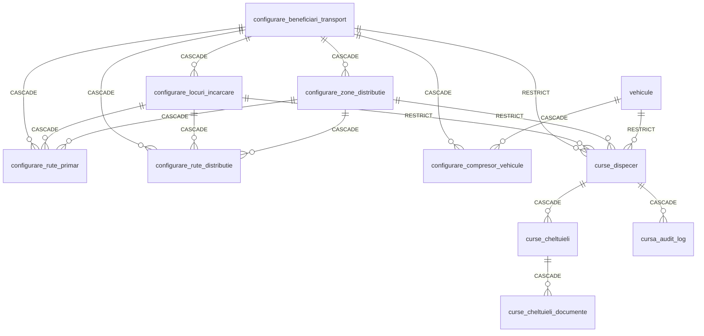
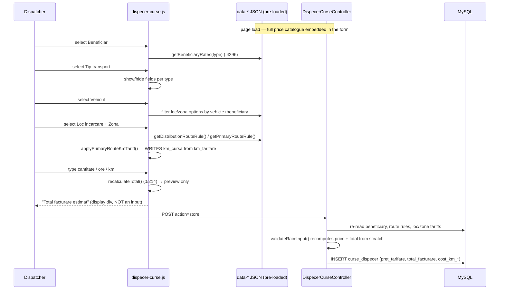
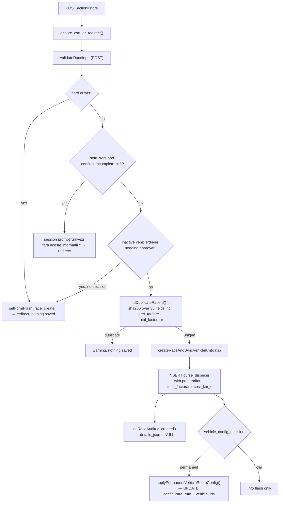
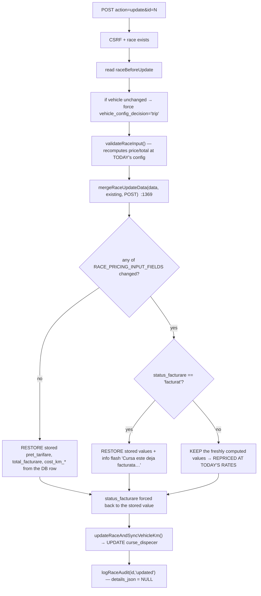
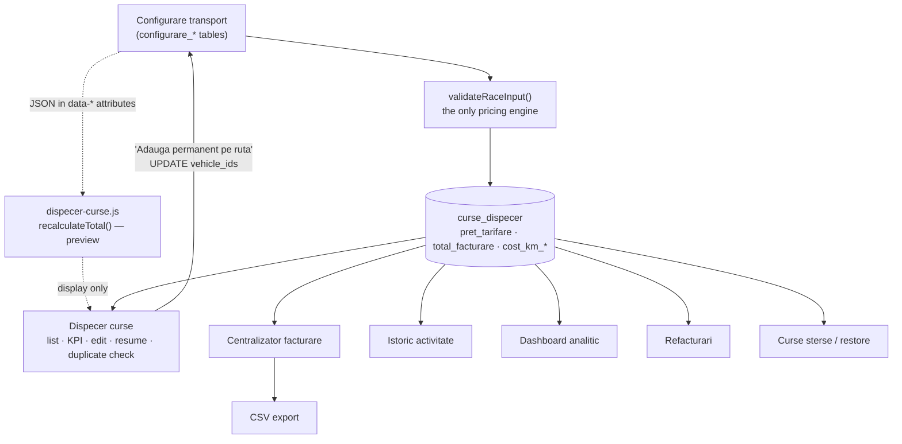
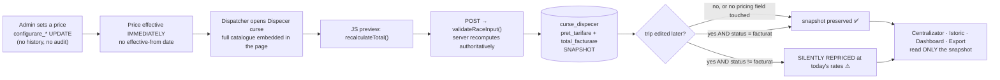

# ANALIZA_CONFIGURARE_TRANSPORT.md

**Read-only reverse-engineering report of the `Configurare transport` module and the whole transport-pricing chain.**

| | |
|---|---|
| Repository | `C:\laragon\www\aplicatie_fleet` |
| Branch / commit at analysis time | `main` @ `2933432` |
| Live schema source | MySQL `if0_41456552_aplicatie_flota` (inspected via `SHOW CREATE TABLE`, read-only) |
| Analysis date | 2026-08-18 |
| Code changed | **none** — analysis only |

> Every claim below is anchored to a file, function and (where practical) a line number, or to a live `SELECT`. Where an earlier document (`ANALIZA.md`, `STARE_PROIECT.md`) contradicts the current code, the current code wins and the divergence is called out explicitly.

---

## 1. Executive Summary

`Configurare transport` (`?page=dispecer_curse&action=config`) is **the only place in the application where commercial transport tariffs are defined**. It is an admin-only, 5-tab wizard bound to a single aggregate root — the **beneficiary** (`configurare_beneficiari_transport`).

Ten findings that matter most for the future pricing page:

1. **Pricing is split across two conceptual levels and four tables, with no single "price list" entity.** Some prices live on the beneficiary (global for that client), some live on the route (`loc → zonă` pair), and the two levels are combined by a cascade of fallbacks implemented in one 836-line method — `DispecerCurseController::validateRaceInput()` (lines 4927–5762).

2. **`Primar km` and `Primar tone` have no per-route price at all.** `configurare_rute_primar` stores only *agreed kilometres* (`km_tarifare`) and an optional flat `cost_cursa`; the lei/km and lei/tonă rates come from `configurare_beneficiari_transport.pret_km` / `.pret_tona`, which are **global per beneficiary**. Verified against live data: every Primar trip in the DB priced at exactly `km × 1.21` (ButanGas & Forvest `pret_km = 1.21`).

3. **Prices are snapshotted onto the trip.** `curse_dispecer.pret_tarifare` (unit rate) and `curse_dispecer.total_facturare` (money) are computed server-side at save time and stored. Every downstream consumer — `Centralizator facturare`, `Istoric activitate`, `Dashboard analitic`, exports — reads **only** those stored columns and never re-joins the configuration price columns. **Changing a price today does not retroactively change a July invoice.**

4. **…but editing an old trip can silently reprice it at today's rates.** `mergeRaceUpdateData()` (lines 1369–1443) recalculates the financials whenever *any* of 13 pricing-input fields changed, unless `status_facturare = 'facturat'`. Only 1 of 58 live trips is `facturat`, so **57 trips are currently exposed** to silent repricing on the next edit.

5. **The pricing engine exists twice** — in PHP (`validateRaceInput`) and in JavaScript (`recalculateTotal`, `assets/js/dispecer-curse.js:5214`) — and the two are **not identical**. At least two divergences confirmed (§13.2). The JS number is only a preview; the server value wins on save, so users can see one number and get another.

6. **Three price columns are still read by the calculation but are no longer editable anywhere in the UI**: `configurare_locuri_incarcare.tarif`, `configurare_zone_distributie.tarif_distributie`, `configurare_zone_distributie.cost_extra_km`. They sit in the middle of the distribution fallback chain. Currently all zero in production (19/19 rows), so they are dormant — but a stray non-zero value would silently override the route tariff.

7. **There is no price history, no effective-from/to date, and no audit trail whatsoever for configuration changes.** `audit_log` covers Documente/Concedii/Leasing; `cursa_audit_log` covers trips only (and even then, `details_json` is `NULL` for `updated`). A price change is completely untraceable: who, when, from what, to what.

8. **The dispatcher page can write into the pricing configuration.** `applyPermanentVehicleRouteConfig()` (lines 627–722) — triggered by the "Adaugă permanent pe rută" button when saving a trip — `UPDATE`s `vehicle_ids` on `configurare_rute_primar` / `configurare_rute_distributie`. Trip creation is **not** admin-gated, so a non-admin operator can change which vehicles a rate applies to.

9. **34 of 58 live trips have `total_facturare = 0` and `pret_tarifare = 0`** — because the missing-tariff error is a *soft* error (non-blocking, confirm-and-save). Two of four beneficiaries (`Vixon`, `Mol Romania`) have every price column at `0.00`.

10. **Tonnage units are inconsistent between pricing and reporting.** The pricing engine treats `cantitate_incarcata` literally (`normalizeTonInputToKgForPricing()` is a documented no-op, line 7709), while reports apply a kg→tonne heuristic (`/1000` if the value looks like kilograms). A trip entered in kg is priced ~1000× too high but reported correctly.

---

## 2. Purpose of `Configurare transport`

### 2.1 What it actually configures

The page is **beneficiary-centric**. Everything hangs off one row in `configurare_beneficiari_transport`. The 5 tabs are a wizard over that aggregate:

| Tab | Panel key | Configures | Backing table |
|---|---|---|---|
| 1. Beneficiar | `beneficiar` | Client identity, which transport types it buys, **global Primar & Compresor rates**, compressor vehicle fleet | `configurare_beneficiari_transport`, `configurare_compresor_vehicule` |
| 2. Catalog | `catalog` | Named loading places and unloading zones for this client | `configurare_locuri_incarcare`, `configurare_zone_distributie` |
| 3. Rute Distribuție | `distributie` | Per-route tariff for pure distribution | `configurare_rute_distributie` (`transport_scope='distributie'`) |
| 4. Rute Primar+Distribuție | `primar_distributie` | Per-route tariff + agreed km for the mixed type | `configurare_rute_distributie` (`transport_scope='primar_distributie'`) |
| 5. Rute Primar | `primar` | Agreed km (and optional flat ride cost) per route — **no rate here** | `configurare_rute_primar` |

Evidence: [config.php:530](htdocs/views/dispecer_curse/config.php:530) (tab nav), panels at [554](htdocs/views/dispecer_curse/config.php:554), [753](htdocs/views/dispecer_curse/config.php:753), [871](htdocs/views/dispecer_curse/config.php:871), [1086](htdocs/views/dispecer_curse/config.php:1086), [1307](htdocs/views/dispecer_curse/config.php:1307).

### 2.2 Field-by-field business meaning

#### Tab 1 — Beneficiar (`config_store_beneficiar`, controller lines 4157–4404)

| Field | POST name | Unit / meaning | Mandatory | Default | Validation (server) | 0 / NULL semantics |
|---|---|---|---|---|---|---|
| Beneficiar | `nume` | Client name | **Yes** | — | non-empty, ≤150 chars, DB `UNIQUE` | — |
| Tipuri transport | `tip_transporturi[]` | Whitelist of `primar`, `distributie`, `primar_distributie`, `compresor` → written to `suporta_*` flags | **Yes, ≥1** | — | "Selecteaza cel putin un tip de transport." | Unticking `compresor` **deletes all** its compressor-vehicle links |
| Status | `activ` | Active/inactive | No | checked (`1`) | checkbox absent ⇒ `0` | Inactive beneficiaries are hidden from the trip form but still editable |
| Pret/km | `pret_km` | **lei / km**, used by `Primar km` | No | `''` → `0.00` | `≥ 0`, comma accepted | `0` ⇒ falls back to `pret_tarifare`; if that is also 0 ⇒ soft error, trip saves with total 0 |
| Pret/tona | `pret_tona` | **lei / tonă**, used by `Primar tone` | No | `''` → `0.00` | `≥ 0` | same fallback chain |
| Pret ora aspirare | `pret_ora_aspirare` | **lei / oră** (Compresor) | No | `0.00` | `≥ 0` | `0` ⇒ that component contributes nothing |
| Pret km dislocare | `pret_km_dislocare` | **lei / km** (Compresor relocation) | No | `0.00` | `≥ 0` | idem |
| Pret tona livrata | `pret_tona_livrata` | **lei / tonă delivered** (Compresor) | No | `0.00` | `≥ 0` | idem |
| Pret tona aspirata lichida | `pret_tona_aspirata_lichida` | **lei / tonă** liquid suction | No | `0.00` | `≥ 0` | `0` **hides the input field** on the trip form (`hasCompressorLiquidSuctionPricing`, line 5487) |
| Pret tona aspirata gazoasa | `pret_tona_aspirata_gazoasa` | **lei / tonă** gas suction | No | `0.00` | `≥ 0` | same hiding behaviour |
| Vehicule Compresor | `compresor_vehicle_ids[]` | Which vehicles may run Compresor for this client | No | — | must be existing **active** vehicles | Empty ⇒ no vehicle offered on the trip form |

**Three price fields are posted as hidden pass-through and can never be edited from the UI** — [config.php:568–570](htdocs/views/dispecer_curse/config.php:568):

```html
<input type="hidden" name="pret_tarifare"          value="…">
<input type="hidden" name="pret_distributie_tona"  value="…">
<input type="hidden" name="pret_distributie_km"    value="…">
```

They are still validated and persisted by the controller, and `pret_distributie_km` **is non-zero for one live beneficiary** (ButanGas = `1.50`) — a value nobody can see or change from the page.

Also note: `tip_marfa` on the beneficiary is **unconditionally wiped to `''`** on every save (controller passes `''` as the 2nd argument to `updateTransportBeneficiary` / `createTransportBeneficiary`, lines 4348 and 4374).

#### Tab 2 — Catalog (`config_store_catalog`)

| Field | POST name | Meaning | Mandatory |
|---|---|---|---|
| Loc incarcare | `loc_nume` | Named loading place, ≤120 chars | At least one of the two |
| Zona descarcare | `zona_nume` | Named unloading zone, ≤120 chars | At least one of the two |

**No tariff inputs.** The form ([config.php:787](htdocs/views/dispecer_curse/config.php:787) and the modal at [1665](htdocs/views/dispecer_curse/config.php:1665)) posts only the two names. The controller *does* accept `loc_tarif`, `zona_tarif_distributie`, `zona_cost_extra_km`, but nothing sends them — see §13.3.

#### Tab 3 — Rute Distribuție (`config_store_distributie`, `route_scope=distributie`)

| Field | POST name | Unit | Mandatory | Range | Notes |
|---|---|---|---|---|---|
| Loc incarcare | `route_loc_id` | FK | **Yes** | must belong to this beneficiary | |
| Zona descarcare | `route_zona_id` | FK | **Yes** | must belong to this beneficiary | |
| Tarife aplicate | `route_tarif_mod` | enum `tona_km` / `tona` / `km` | **Yes** | default `tona_km` | selects which of the next two apply |
| Pret tona (RON) | `route_tarif_tona` | **lei / tonă** | Yes when mode uses tonnage | `≥ 0`, step 0.01 | forced to `0` when mode is `km` |
| Pret km (RON) | `route_cost_extra_km` | **lei / km** | Yes when mode uses km | `≥ 0` | forced to `0` when mode is `tona` |
| Vehicule | `route_vehicle_ids[]` | Scope of the rule | **Yes, ≥1** | active vehicles only | stored as sorted CSV; `NULL` = "any vehicle" |

`km_tarifare`, `cost_cursa`, `aplica_cost_cursa` are **hard-forced to 0/false** for this scope (controller lines 3008–3012).

#### Tab 4 — Rute Primar+Distribuție (`config_store_distributie`, `route_scope=primar_distributie`)

Same endpoint, different scope. Differences:

| Field | POST name | Unit | Mandatory | Notes |
|---|---|---|---|---|
| Tarife aplicate | — | — | — | **not offered**; hard-locked to `tona_km` (line 3002) |
| Pret tona (RON) | `route_tarif_tona` | lei / tonă | **Yes** | |
| Pret km (RON) | `route_cost_extra_km` | lei / km | **Yes** | |
| Km agreati | `route_km_tarifare` | **integer km** | **Yes** | must be `> 0`; pre-fills `km_cursa` on the trip form |
| Cost cursa (RON) | `route_cost_cursa` | **flat lei / trip** | No | |
| Aplicare Cost Cursa | `route_aplica_cost_cursa` | switch | No | if on, `cost_cursa` must be `> 0`; **overrides the whole formula** |

#### Tab 5 — Rute Primar (`config_store_primar_ruta`)

| Field | POST name | Unit | Mandatory | Notes |
|---|---|---|---|---|
| Loc incarcare / Zona | `route_primar_loc_id` / `route_primar_zona_id` | FK | **Yes** | |
| Km tarifare | `route_primar_km_tarifare` | **integer km** | Yes unless manual-km is on | `min=1`; **this is a quantity, not a price** |
| Km agreati — introducere manuala | `route_primar_km_agreati_manual` | switch | No | when on, clears+disables the km input and stores `km_tarifare = 0`; the dispatcher types km per trip |
| Cost cursa (RON) | `route_primar_cost_cursa` | flat lei / trip | No | |
| Aplicare Cost Cursa | `route_primar_aplica_cost_cursa` | switch | No | overrides `km × pret_km` |
| Vehicule | `route_primar_vehicle_ids[]` | rule scope | **Yes, ≥1** | enables *different agreed km per garage* for the same pair |
| Activ | `route_primar_activ` | switch | No | **absent from POST ⇒ `true`** |

**There is no lei/km field on this tab.** The rate is the beneficiary-global `pret_km`.

### 2.3 Numeric parsing

`normalizeDecimal()` (controller line 7671) strips spaces and converts `,` → `.`, so `"1 234,56"` is accepted as `1234.56`. Non-numeric ⇒ `null` ⇒ "…este invalid.". Empty string ⇒ `0.0` (not an error) for every price field.

---

## 3. Files and Architecture

### 3.1 Dependency map

```
Browser  GET  index.php?page=dispecer_curse&action=config
  │
  ├─ htdocs/index.php:429-430  require_route_access('dispecer_curse')   ← page-level 'view' only
  ├─ htdocs/index.php:545      case 'dispecer_curse' → require_auth()
  │
  ▼
DispecerCurseController::handle('config')                      controllers/DispecerCurseController.php:85-203
  ▼
DispecerCurseController::configAction()                        :2448
  ├─ require_admin_or_403()                                    :2450  ← hard admin gate
  ├─ consumeFormFlash() × 7                                    :2452-2467
  ├─ syncPrimaryRouteBidirectionalCatalog()  ⚠ WRITES on GET   :2603 → :5846
  └─ DispecerCurseModel
        ├─ getTransportBeneficiaries(false)                    models/DispecerCurseModel.php:2593
        ├─ getLoadLocations / getDistributionZones             :299 / :880
        ├─ getDistributionRouteRules(scope)                    :1187
        ├─ getPrimaryRouteRules()                              :1528
        ├─ getVehicleOptions() / vehicle capacity groups
        └─ ensure*Table()  ⚠ DDL on the request path           :1618 :1825 :1919 …
  ▼
render('dispecer_curse/config.php')                            views/dispecer_curse/config.php  (3980 lines)
  ├─ PHP prolog                    1-410
  ├─ HTML: sidebar + 5 tab panels  411-1700
  ├─ <style>                       ~1700-2900   (.tcv2-* design system)
  └─ inline <script>               ~2900-3980   (no AJAX at all)
  ▼
htdocs/assets/js/app.js:1-15   data-confirm interceptor (delete confirmations)
```

**POST side (all 13 endpoints):**

```
POST index.php?page=dispecer_curse&action=config_store_*
  ▼
handle() → configStore*Action()
  ├─ require_admin_or_403()
  ├─ REQUEST_METHOD === 'POST'
  ├─ ensure_csrf_or_redirect()            includes/csrf.php:27
  ├─ validate → setFormFlash() on error   :7719
  └─ DispecerCurseModel::save*            → INSERT/UPDATE
  ▼
302 redirect back to action=config  (PRG pattern; no JSON, no AJAX)
```

**Consumption side (where the configured price is actually used):**

```
configurare_beneficiari_transport ─┐
configurare_rute_primar ───────────┤
configurare_rute_distributie ──────┼─► DispecerCurseController::validateRaceInput()   :4927-5762
configurare_locuri_incarcare.tarif ┤        (single authoritative pricing engine)
configurare_zone_distributie.* ────┘
                                            │
                     ┌──────────────────────┴──────────────────────┐
                     ▼                                             ▼
      curse_dispecer.pret_tarifare                  assets/js/dispecer-curse.js
      curse_dispecer.total_facturare                  recalculateTotal()  :5214
      curse_dispecer.cost_km_*                        (preview only — parallel implementation)
                     │
      ┌──────────────┼───────────────┬─────────────────┬──────────────────┐
      ▼              ▼               ▼                 ▼                  ▼
Centralizator   Istoric        Dashboard          CSV export        Dispecer curse
 facturare     activitate       analitic        (same service)      list + KPIs
(CentralizatorFacturareService)  (DispecerCurseModel::getDashboardAnalyticData :5954)
```

### 3.2 File inventory

| Role | Path | Detail |
|---|---|---|
| Router | [htdocs/index.php:545](htdocs/index.php:545) | `case 'dispecer_curse'` → `require_auth()` → controller |
| Route guard | [htdocs/index.php:429](htdocs/index.php:429) | `require_route_access($page)` — checks only the `view` action |
| Controller | [htdocs/controllers/DispecerCurseController.php](htdocs/controllers/DispecerCurseController.php) | 7900+ lines; `handle()` 85–203, `configAction()` 2448, 12 `config*Action()` methods |
| Model | [htdocs/models/DispecerCurseModel.php](htdocs/models/DispecerCurseModel.php) | 8000+ lines; all config CRUD + all trip CRUD + all dashboard SQL |
| View (real) | [htdocs/views/dispecer_curse/config.php](htdocs/views/dispecer_curse/config.php) | 3980 lines: PHP + HTML + CSS + JS in one file |
| View (sandbox) | [htdocs/views/dispecer_curse/config_v2.php](htdocs/views/dispecer_curse/config_v2.php) | byte-identical except **15 GET links** pointing to `action=config_v2`. All POSTs hit the **real** endpoints and write the **real** DB, then redirect to `action=config`. |
| Trip form (create) | [htdocs/views/dispecer_curse/index.php:607](htdocs/views/dispecer_curse/index.php:607) | carries the entire price catalogue in `data-*` attributes |
| Trip form (edit) | [htdocs/views/dispecer_curse/edit.php:237](htdocs/views/dispecer_curse/edit.php:237) | same JSON payload, same JS file |
| Trip JS | [htdocs/assets/js/dispecer-curse.js](htdocs/assets/js/dispecer-curse.js) | `getBeneficiaryRates()` 4296, `recalculateTotal()` 5214 |
| Billing service | [htdocs/services/CentralizatorFacturareService.php](htdocs/services/CentralizatorFacturareService.php) | 2050 lines; reads only trip snapshots |
| Billing controller | [htdocs/controllers/CentralizatorFacturareController.php](htdocs/controllers/CentralizatorFacturareController.php) | serves both `centralizator_facturare` and `istoric_activitate` |
| Auth | [htdocs/includes/auth.php:54](htdocs/includes/auth.php:54) | `require_admin_or_403()` |
| CSRF | [htdocs/includes/csrf.php:27](htdocs/includes/csrf.php:27) | `ensure_csrf_or_redirect()` |
| Permission catalog | [htdocs/config/permissions.php:57](htdocs/config/permissions.php:57) | declares `dispecer_curse.config` as `admin: true` — **never enforced via `can()`** |

### 3.3 Endpoint table

| `action=` | Method | Guard | Writes | Redirects to |
|---|---|---|---|---|
| `config` | GET | admin | ⚠ *catalog rows via bidirectional sync* | — |
| `config_v2` | GET | admin | idem | — |
| `config_store_beneficiar` | POST | admin + CSRF | `configurare_beneficiari_transport`, `configurare_compresor_vehicule` | `config&beneficiar_edit_id=` |
| `config_store_catalog` | POST | admin + CSRF | `configurare_locuri_incarcare`, `configurare_zone_distributie` | `config&beneficiar_edit_id=` |
| `config_store_distributie` | POST | admin + CSRF | `configurare_rute_distributie` (both scopes) | `config&beneficiar_edit_id=` |
| `config_store_primar_ruta` | POST | admin + CSRF | `configurare_rute_primar` + catalog mirror | `config&beneficiar_edit_id=` |
| `config_delete_ruta` | POST | admin + CSRF | DELETE `configurare_rute_distributie` | `config&beneficiar_edit_id=` |
| `config_delete_ruta_primar` | POST | admin + CSRF | DELETE `configurare_rute_primar` | `config&beneficiar_edit_id=` |
| `config_delete_beneficiar` | POST | admin + CSRF | DELETE beneficiary (RESTRICT if used in trips) | `config` |
| `config_delete_beneficiari` | POST | admin + CSRF | bulk DELETE, no global transaction | `config` |
| `config_store_loc` | POST | admin + CSRF | **ORPHAN** — no form posts here | `config` |
| `config_store_zona` | POST | admin + CSRF | **ORPHAN** | `config` |
| `config_delete_loc` | POST | admin + CSRF | **ORPHAN**; ownership check skipped when `beneficiar_id` = 0 | `config` |
| `config_delete_zona` | POST | admin + CSRF | **ORPHAN**; same gap | `config` |

**No AJAX anywhere on this page** — `grep -c "fetch(\|XMLHttpRequest" config.php` = **0**. Everything is classic POST → Redirect → GET with session flash.

---

## 4. Database Structure

### 4.1 Configuration tables (live schema)

```
TABLE: configurare_beneficiari_transport            ← the pricing root
  id                          INT UNSIGNED PK
  nume                        VARCHAR(150)   UNIQUE
  tip_marfa                   VARCHAR(50) NULL     -- legacy; wiped to '' on every save
  pret_tarifare               DECIMAL(12,2) NOT NULL DEFAULT 0.00   -- hidden, "base rate" fallback
  suporta_primar              TINYINT(1) DEFAULT 1
  suporta_distributie         TINYINT(1) DEFAULT 1
  suporta_primar_distributie  TINYINT(1) DEFAULT 0
  suporta_compresor           TINYINT(1) DEFAULT 0
  pret_km                     DECIMAL(12,2) DEFAULT 0.00  -- lei/km,  Primar km      [EDITABLE]
  pret_tona                   DECIMAL(12,2) DEFAULT 0.00  -- lei/t,   Primar tone    [EDITABLE]
  pret_distributie_km         DECIMAL(12,2) DEFAULT 0.00  -- lei/km,  Distributie    [HIDDEN]
  pret_distributie_tona       DECIMAL(12,2) DEFAULT 0.00  -- lei/t,   Distributie    [HIDDEN]
  pret_ora_aspirare           DECIMAL(12,2) DEFAULT 0.00  -- lei/h,   Compresor      [EDITABLE]
  pret_km_dislocare           DECIMAL(12,2) DEFAULT 0.00  -- lei/km,  Compresor      [EDITABLE]
  pret_tona_livrata           DECIMAL(12,2) DEFAULT 0.00  -- lei/t,   Compresor      [EDITABLE]
  pret_tona_aspirata_lichida  DECIMAL(12,2) DEFAULT 0.00  -- lei/t,   Compresor      [EDITABLE]
  pret_tona_aspirata_gazoasa  DECIMAL(12,2) DEFAULT 0.00  -- lei/t,   Compresor      [EDITABLE]
  activ                       TINYINT(1) DEFAULT 1
  created_at, updated_at      DATETIME             -- no created_by / updated_by
```

```
TABLE: configurare_locuri_incarcare
  id, beneficiar_id → configurare_beneficiari_transport (CASCADE)
  nume        VARCHAR(120)      UNIQUE (beneficiar_id, nume)
  tarif       DECIMAL(10,2) DEFAULT 0.00   ⚠ read by the engine, NOT editable in the UI
  activ, created_at, updated_at
```

```
TABLE: configurare_zone_distributie
  id, beneficiar_id → … (CASCADE)
  nume               VARCHAR(120)  UNIQUE (beneficiar_id, nume)
  tarif_distributie  DECIMAL(10,2) DEFAULT 0.00  ⚠ read by the engine, NOT editable in the UI
  cost_extra_km      DECIMAL(10,2) DEFAULT 0.00  ⚠ idem
  activ, created_at, updated_at
```

```
TABLE: configurare_rute_primar                       ← Primar km / Primar tone
  id, beneficiar_id, loc_incarcare_id, zona_distributie_id   (all CASCADE)
  km_tarifare        INT UNSIGNED DEFAULT 0    -- AGREED KM (a quantity, not a price)
  cost_cursa         DECIMAL(12,2) DEFAULT 0.00 -- flat lei/trip
  aplica_cost_cursa  TINYINT(1) DEFAULT 0
  vehicle_ids        TEXT NULL                  -- CSV; NULL = any vehicle
  km_agreati_manual  TINYINT(1) DEFAULT 0
  activ, created_at, updated_at
  -- ⚠ NO UNIQUE KEY on (beneficiar, loc, zona): the same pair may carry several rules,
  --   differentiated by vehicle set (different agreed km per garage).
  -- ⚠ NO price column at all.
```

```
TABLE: configurare_rute_distributie                  ← Distributie + Primar+Distributie
  id, beneficiar_id, loc_incarcare_id, zona_distributie_id   (all CASCADE)
  transport_scope   ENUM('distributie','primar_distributie') DEFAULT 'primar_distributie'
  tarif_mod         ENUM('tona_km','tona','km')  DEFAULT 'tona_km'
  tarif_tona        DECIMAL(10,2) DEFAULT 0.00   -- lei/tonă   ← THE distribution price
  cost_extra_km     DECIMAL(10,2) DEFAULT 0.00   -- lei/km     ← THE distribution km price
  km_tarifare       INT UNSIGNED  DEFAULT 0      -- agreed km (P+D only)
  cost_cursa        DECIMAL(12,2) DEFAULT 0.00   -- flat lei/trip (P+D only)
  aplica_cost_cursa TINYINT(1)    DEFAULT 0
  vehicle_ids       TEXT NULL
  activ, created_at, updated_at
  UNIQUE KEY (beneficiar_id, loc_incarcare_id, zona_distributie_id, transport_scope)
```

```
TABLE: configurare_compresor_vehicule
  id, beneficiar_id → …(CASCADE), vehicle_id → vehicule (CASCADE)
  UNIQUE (beneficiar_id, vehicle_id)
```

Plus two default-assignment tables used for form pre-fill only (no pricing role):
`configurare_locuri_incarcare_vehicule`, `configurare_zone_distributie_vehicule` — both `UNIQUE (beneficiar_id, vehicle_id)`, so re-assigning a vehicle silently steals it from its previous place.

### 4.2 The trip table (price destination)

```
TABLE: curse_dispecer
  id, vehicle_id → vehicule (RESTRICT), driver_id → soferi (SET NULL)
  tip_transport ENUM('primar','primar_tona','distributie','primar_distributie','compresor')
  data_cursa / data_incarcare / data_inceput / data_sfarsit / ora_* / durata_cursa_minute
  loc_incarcare_id      → configurare_locuri_incarcare  (RESTRICT)
  zona_distributie_id   → configurare_zone_distributie  (RESTRICT)
  beneficiar_id         → configurare_beneficiari_transport (RESTRICT)
  capacitate_transport  DECIMAL(10,2)   -- snapshot of the vehicle capacity at save time
  tip_marfa             VARCHAR(255)    -- CSV of butan/propan/autogaz
  -- measured quantities
  cantitate_incarcata, cantitate_prelevata, km_cursa, km_totali, nr_clienti,
  ore_functionare, ore_aspirare, km_dislocare,
  tona_livrata, tona_aspirata_lichida, tona_aspirata_gazoasa
  -- FINANCIAL SNAPSHOT  ← the only historical record of price
  pret_tarifare     DECIMAL(12,2) NOT NULL   -- representative UNIT rate
  total_facturare   DECIMAL(12,2) NOT NULL   -- money
  cost_km_primar    DECIMAL(12,2) DEFAULT 0.00
  cost_km_distributie DECIMAL(12,2) DEFAULT 0.00
  cost_km_mixt      DECIMAL(12,2) DEFAULT 0.00
  cost_km_compresor DECIMAL(12,2) DEFAULT 0.00
  status_facturare  ENUM('in_curs_facturare','facturat','nefacturat') DEFAULT 'in_curs_facturare'
  duplicate_key     CHAR(64) UNIQUE      -- sha256 of ~38 fields INCLUDING the financials
  parent_cursa_id, created_by, deleted_at, deleted_by, created_at, updated_at
```

⚠ **`curse_dispecer` stores no reference to which configuration row produced the price** — no `rule_id`, no `price_version_id`. The snapshot is `pret_tarifare` + `total_facturare` only.

### 4.3 Entity relationships



**Deletion asymmetry that matters for pricing:**
- Deleting a **beneficiary** is *blocked* (`RESTRICT`) if any trip references it — history is protected.
- Deleting a **loading place or zone** is *also* blocked by `RESTRICT` from `curse_dispecer`… **but** the orphan endpoints `config_delete_loc` / `config_delete_zona` first `UPDATE curse_dispecer SET loc_incarcare_id = NULL` to detach the history, then delete — cascading away every route rule attached to it. Those endpoints are unreachable from the UI today but remain live.

---

## 5. Transport Types

### 5.1 Canonical list

The authoritative list is `DispecerCurseController::TRANSPORT_TYPES` ([lines 11–16](htdocs/controllers/DispecerCurseController.php:11)) and the `curse_dispecer.tip_transport` ENUM. **Five** types:

| Displayed label | Internal value | DB value (`curse_dispecer.tip_transport`) | Used in |
|---|---|---|---|
| Primar km | `primar` | `primar` | trip form, config tab 1+5, billing, dashboard |
| Primar tone | `primar_tona` | `primar_tona` | trip form, billing, dashboard |
| Distributie | `distributie` | `distributie` | trip form, config tab 1+3, billing |
| Primar+Distributie | `primar_distributie` | `primar_distributie` | trip form, config tab 1+4, billing |
| Compresor | `compresor` | `compresor` | trip form, config tab 1, billing |

### 5.2 The critical asymmetry: 5 trip types vs 4 configuration flags

`configurare_beneficiari_transport` has only **four** `suporta_*` columns. **`primar` and `primar_tona` share `suporta_primar`** — evidence: `resolveBeneficiaryRate()` line 6819:

```php
if ($transportType === 'primar' || $transportType === 'primar_tona') {
    if (!$supportsPrimary) { return 0.0; }
    …
}
```

and the config checkbox whitelist (line 4186) accepts only `['primar','distributie','primar_distributie','compresor']`.

**Consequence:** an administrator cannot enable "Primar tone" without also enabling "Primar km", and vice-versa. Ticking `primar` enables both.

### 5.3 Naming inconsistencies found

| Location | Label used |
|---|---|
| `DispecerCurseController::TRANSPORT_TYPES` | `Primar km`, `Primar tone`, `Distributie`, `Primar+Distributie`, `Compresor` |
| `CentralizatorFacturareService::TRANSPORT_TYPES` ([:6](htdocs/services/CentralizatorFacturareService.php:6)) | `Primar km`, `Primar tone`, **`P+D (Primar+Distribuție)`** (short `P+D`), **`Distribuție`** (with diacritics), `Compresor` |
| `DashboardAnaliticController::TRANSPORT_TYPE_LABELS` ([:8](htdocs/controllers/DashboardAnaliticController.php:8)) | `Primar km`, `Primar tone`, `Distributie`, `Primar+Distributie`, `Compresor` |
| `config.php` `$transportTypeOptions` ([:2](htdocs/views/dispecer_curse/config.php:2)) | only **4** entries — `primar_tona` absent by design |
| `configurare_rute_distributie.transport_scope` | `distributie` / `primar_distributie` (2 values covering 2 of the 5 trip types) |

**Legacy / dead values still referenced in code:**
- `'mixt'` — checked at controller line 5651 (`$transportType === 'primar_distributie' || $transportType === 'mixt'`) and in JS line 5399, but is **not** in the ENUM and not in `TRANSPORT_TYPES`. Dead branch.
- The `reset_database.sql` baseline still declares the old 3-value ENUM `('primar','distributie','compresor')` — stale; the live schema has 5.

### 5.4 Type-predicate helpers (the real hard-coded checks)

| Helper | Line | Returns true for |
|---|---|---|
| `isPrimaryKmTransportType()` | 5917 | `primar` |
| `isPrimaryTonTransportType()` | 5922 | `primar_tona` |
| `isDistributionTransportType()` | 5763 | `distributie`, `primar_distributie` |
| `isDistributionWithKmTransportType()` | 5912 | `primar_distributie` only |
| `resolveDistributionRouteScopeFromTransportType()` | 5768 | maps trip type → `transport_scope` |
| (compressor) | inline | `$transportType === 'compresor'` — no helper |

The same five predicates are re-implemented in JavaScript (`isPrimaryKmTransport`, `isPrimaryTonTransport`, `isDistributionTransport`, `isDistributionWithKmTransport`) in `assets/js/dispecer-curse.js`.

---

## 6. Current Price Configuration

### 6.1 Where each price physically lives

| Transport type | Rate | Table | Column | Type | Default | Unit | Editable in UI? |
|---|---|---|---|---|---|---|---|
| **Primar km** | lei/km | `configurare_beneficiari_transport` | `pret_km` | `DECIMAL(12,2)` | `0.00` | lei/km | ✅ tab 1 |
| Primar km | flat override | `configurare_rute_primar` | `cost_cursa` + `aplica_cost_cursa` | `DECIMAL(12,2)` | `0.00` | lei/trip | ✅ tab 5 |
| Primar km | *quantity* | `configurare_rute_primar` | `km_tarifare` | `INT UNSIGNED` | `0` | km | ✅ tab 5 |
| **Primar tone** | lei/tonă | `configurare_beneficiari_transport` | `pret_tona` | `DECIMAL(12,2)` | `0.00` | lei/tonă | ✅ tab 1 |
| **Distribuție** | lei/tonă | `configurare_rute_distributie` | `tarif_tona` | `DECIMAL(10,2)` | `0.00` | lei/tonă | ✅ tab 3 |
| Distribuție | lei/km | `configurare_rute_distributie` | `cost_extra_km` | `DECIMAL(10,2)` | `0.00` | lei/km | ✅ tab 3 |
| Distribuție | *fallback 1* | `configurare_zone_distributie` | `tarif_distributie` | `DECIMAL(10,2)` | `0.00` | lei/tonă | ❌ **dormant** |
| Distribuție | *fallback 2* | `configurare_locuri_incarcare` | `tarif` | `DECIMAL(10,2)` | `0.00` | lei/tonă | ❌ **dormant** |
| Distribuție | *fallback 3* | `configurare_zone_distributie` | `cost_extra_km` | `DECIMAL(10,2)` | `0.00` | lei/km | ❌ **dormant** |
| Distribuție | *fallback 4* | `configurare_beneficiari_transport` | `pret_distributie_tona` / `pret_distributie_km` | `DECIMAL(12,2)` | `0.00` | lei/t, lei/km | ❌ **hidden input** |
| **P+D** | lei/tonă + lei/km | `configurare_rute_distributie` | `tarif_tona`, `cost_extra_km` | `DECIMAL(10,2)` | `0.00` | | ✅ tab 4 |
| P+D | flat override | `configurare_rute_distributie` | `cost_cursa` + `aplica_cost_cursa` | `DECIMAL(12,2)` | `0.00` | lei/trip | ✅ tab 4 |
| P+D | *quantity* | `configurare_rute_distributie` | `km_tarifare` | `INT UNSIGNED` | `0` | km | ✅ tab 4 |
| **Compresor** | lei/oră | `configurare_beneficiari_transport` | `pret_ora_aspirare` | `DECIMAL(12,2)` | `0.00` | lei/h | ✅ tab 1 |
| Compresor | lei/km | " | `pret_km_dislocare` | `DECIMAL(12,2)` | `0.00` | lei/km | ✅ tab 1 |
| Compresor | lei/tonă | " | `pret_tona_livrata` | `DECIMAL(12,2)` | `0.00` | lei/tonă | ✅ tab 1 |
| Compresor | lei/tonă | " | `pret_tona_aspirata_lichida` | `DECIMAL(12,2)` | `0.00` | lei/tonă | ✅ tab 1 |
| Compresor | lei/tonă | " | `pret_tona_aspirata_gazoasa` | `DECIMAL(12,2)` | `0.00` | lei/tonă | ✅ tab 1 |
| **All (legacy)** | generic base | `configurare_beneficiari_transport` | `pret_tarifare` | `DECIMAL(12,2)` | `0.00` | ambiguous | ❌ **hidden input** |

### 6.2 Which dimensions pricing depends on today

| Dimension | Supported? | Where |
|---|---|---|
| Transport type | ✅ yes | separate columns / separate tables per type |
| Client / beneficiary | ✅ yes | everything is per `beneficiar_id` |
| Route (`loc → zonă`) | ✅ **Distribuție & P+D only** | `configurare_rute_distributie` |
| Loading location alone | ⚠ dormant | `configurare_locuri_incarcare.tarif` |
| Unloading zone alone | ⚠ dormant | `configurare_zone_distributie.tarif_distributie` |
| **Vehicle** | ✅ yes | `vehicle_ids` CSV on both route tables — a rule applies only to listed vehicles |
| **Capacity** | ❌ no | capacity groups exist only as a **UI grouping** in the vehicle pickers; never used in the calculation |
| **Commodity (`tip_marfa`)** | ❌ **removed** | wiped to `''` on beneficiary save; used only for reporting breakdowns |
| **Date / period** | ❌ **none** | no `valabil_de_la`, no `valabil_pana_la`, no versioning anywhere |
| Direction of the route | ⚠ implicit | route lookup is **bidirectional** — `A→B` also matches `B→A` (§7.3) |
| Tariff mode | ✅ yes | `tarif_mod` (`tona_km` / `tona` / `km`) — Distribuție only |

### 6.3 Live production data (2026-08-18)

```
configurare_beneficiari_transport — 4 rows, all active
 id  nume         sp sd spd sc  pret_tarifare pret_km pret_tona pret_distributie_km  pret_ora_aspirare  pret_tona_livrata
 33  ButanGas      1  1   1  1        0.00      1.21     60.00              1.50            80.00              50.00
 53  Forvest       1  1   0  0        0.00      1.21      0.00              0.00             0.00               0.00
 54  Vixon         1  0   0  0        0.00      0.00      0.00              0.00             0.00               0.00
 55  Mol Romania   1  1   0  0        0.00      0.00      0.00              0.00             0.00               0.00

configurare_locuri_incarcare   — 19 rows, tarif > 0 in  0 rows
configurare_zone_distributie   — 19 rows, tarif_distributie > 0 in 0 rows, cost_extra_km > 0 in 0 rows
configurare_rute_distributie   — 13 rows (9 'distributie', 4 'primar_distributie')
configurare_rute_primar        — 11 rows; every one has cost_cursa = 0 except id 15 (4000.00, aplica = 0)
```

Two of four beneficiaries (`Vixon`, `Mol Romania`) have **zero prices everywhere** — every trip they generate is worth 0 lei.

---

## 7. Price Lookup Flow

### 7.1 There is no AJAX — the whole catalogue is pre-rendered

At page render, `indexAction()` (lines 437–590) loads *all* pricing data for *all* beneficiaries and serialises it into `data-*` attributes on the trip form ([index.php:607](htdocs/views/dispecer_curse/index.php:607)):

| Attribute | Source | Content |
|---|---|---|
| `data-beneficiary-pricing` | `buildBeneficiaryPricingMap()` :6703 | all 10 price columns + 4 `suporta_*` flags, keyed by beneficiary id |
| `data-distribution-route-tariffs` | `getDistributionRouteTariffMap()` model :1231 | keyed `locId\|zoneId` → array of rules (scope, mode, tarif_tona, cost_extra_km, km_tarifare, cost_cursa, vehicle_ids) |
| `data-primary-route-km-map` | `getPrimaryRouteKmMap()` model :1564 | keyed `benefId\|locId\|zoneId` → default entry + `variants[]` |
| `data-load-location-tariffs` | `getLoadLocationTariffs()` model :299 | dormant loc tariffs |
| `data-zone-tariffs`, `data-zone-extra-km-costs` | model :880, :896 | dormant zone tariffs |

JS parses them at lines 366–398. **Consequence:** the entire commercial price list of every client is delivered to the browser of every user who can open Dispecer curse.

### 7.2 Sequence when a dispatcher builds a trip



**The user cannot override the price.** The preview is a `<div data-role="total-preview">` ([index.php:953](htdocs/views/dispecer_curse/index.php:953)), not a form field. `pret_tarifare` and `total_facturare` are never read from `$_POST` — they are assigned only from the computed values (controller lines 5752–5753).

### 7.3 Route-rule resolution (the hard part)

**Primary routes** — `resolvePrimaryRouteRuleForBeneficiaryBidirectional()` (:7265) tries, in order:

1. exact `(beneficiar, loc, zonă)` by id → `getPrimaryRouteRuleForBeneficiary()` (model :1441)
2. **reversed** `(beneficiar, zonă, loc)` by id
3. exact match by **normalised names** (`normalizeDistributionPointName()` :7653 — lowercase + transliterate + collapse whitespace)
4. reversed match by names

Within a matched set, the vehicle tie-break (model :1483–1502) is:
`rule containing this vehicle` → `rule with empty vehicle_ids` → if exactly one rule, that rule → otherwise **no match**.

**Distribution routes** — `resolveDistributionRouteScopeForVehicle()` (:7002) builds a per-vehicle scoped map, then `resolveDistributionRouteRuleFromScopedMap()` (:7145) matches by id-pair, then by name-pair, in both directions.

⚠ **The two tie-breaks disagree.** In `resolveDistributionRouteScopeForVehicle` lines 7101–7108: if *any* rule for that beneficiary+scope has a non-empty `vehicle_ids`, then rules with an **empty** `vehicle_ids` are silently **excluded** for the selected vehicle. The primary path does the opposite (falls back to the unrestricted rule). A "applies to all vehicles" distribution rule therefore stops working the moment a sibling rule is given a vehicle list.

---

## 8. Trip Creation Flow



Evidence: `storeAction()` lines 979–1088; `applyPermanentVehicleRouteConfig()` 627–722; `logRaceAudit` model :4535 (called at :4188 with no details).

**Key facts:**
- Missing tariffs produce **soft errors**, not hard errors — the trip saves with `total_facturare = 0` after a single confirmation. This is why 34/58 live trips are worth 0.
- For `Primar`, `km_cursa` is **overwritten by the configuration**: `$km = $primaryRouteKmTariff;` (line 5285) unless `km_agreati_manual` is set.
- For `primar_distributie`, `km_cursa` is filled from `km_tarifare` when left empty (line 5419).
- Trip creation **writes to the pricing configuration** when "Adaugă permanent pe rută" is chosen.

---

## 9. Trip Update Flow

This is the single most important behaviour for the new pricing page.



### 9.1 The recalculation trigger list

`RACE_PRICING_INPUT_FIELDS` ([lines 1332–1345](htdocs/controllers/DispecerCurseController.php:1332)) — changing **any** of these re-prices the trip:

```
tip_transport, beneficiar_id, vehicle_id, loc_incarcare_id, zona_distributie_id,
km_cursa, km_totali, cantitate_incarcata, ore_aspirare, km_dislocare,
tona_livrata, tona_aspirata_lichida, tona_aspirata_gazoasa
```

Comparison is value-based via a `canonical()` closure (numeric → `%.4F`, empty → `null`), so re-saving with identical values does **not** trigger recalculation.

### 9.2 Trigger matrix

| Changed on edit | Recalculates price? | Why |
|---|---|---|
| Tip transport | ✅ | in the list |
| Beneficiar | ✅ | in the list |
| Vehicul | ✅ | in the list (also changes which vehicle-scoped rule applies) |
| Loc încărcare | ✅ | in the list |
| Zonă descărcare | ✅ | in the list |
| Km efectuați / Km totali | ✅ | in the list |
| Cantitate încărcată | ✅ | in the list |
| Ore aspirare / Km dislocare / Tone (all 3) | ✅ | in the list |
| Șofer | ❌ | not in the list |
| Date / hours / duration | ❌ | not in the list |
| Tip marfă | ❌ | not in the list |
| Nr. clienți / Cantitate prelevată | ❌ | not in the list |
| Observații | ❌ | not in the list |
| Compressor text locations | ❌ | not in the list |
| **Nothing** (plain re-save) | ❌ | canonical comparison finds no diff |
| Any of the above **while `status_facturare='facturat'`** | ❌ | explicit guard + info flash |

### 9.3 Value-preservation logic

`mergeRaceUpdateData()` also implements "absent from POST ≠ deleted":
- `km_totali`, `nr_clienti`, `cantitate_prelevata` are always preserved when not posted;
- when the transport type is unchanged, 13 more fields are preserved when not posted (so JS-disabled inputs do not wipe stored data);
- `data_cursa` and `capacitate_transport` are treated as historical snapshots and are not rewritten;
- `status_facturare` is always forced back to the stored value (it is changed only from `Centralizator facturare`).

---

## 10. Pricing Formula per Transport Type

All formulas from `validateRaceInput()`, price block lines 5431–5517, total block 5519–5595, cost/km block 5597–5672. **Verified against live rows.**

### 10.1 `primar` — Primar km

```
km        = configurare_rute_primar.km_tarifare        (unless km_agreati_manual = 1 → operator input)
pret_km   = beneficiar.pret_km  (if 0 → beneficiar.pret_tarifare)

if rule.aplica_cost_cursa AND rule.cost_cursa > 0:
        pret_tarifare   = rule.cost_cursa
        total_facturare = rule.cost_cursa
else:
        pret_tarifare   = pret_km
        total_facturare = km × pret_km

cost_km_primar = total_primar / km
cost_km_mixt   = cost_km_primar
```

*Live check — trip #340: 630 km × 1.21 = **762.30** ✓; trip #339: 1350 × 1.21 = **1633.50** ✓*

### 10.2 `primar_tona` — Primar tone

```
tone      = cantitate_incarcata          (used literally, no unit conversion)
pret_tona = beneficiar.pret_tona  (if 0 → beneficiar.pret_tarifare)

if rule.aplica_cost_cursa AND rule.cost_cursa > 0:
        total_facturare = rule.cost_cursa
else:
        pret_tarifare   = pret_tona
        total_facturare = tone × pret_tona

-- NOTE: km still comes from the Primar route rule and is stored, but is NOT billed.
cost_km_primar = total_primar / km_primar   where total_primar = km_primar × pret_km  (≠ total_facturare)
```

*Live check — trip #342: 9.00 t × 60.00 = **540.00** ✓; trip #341: 6.50 × 60 = **390.00** ✓*

⚠ Note the inconsistency: for `primar_tona`, `total_facturare` is tonnage-based, but `cost_km_primar` is derived from a **km × pret_km** figure that is never invoiced.

### 10.3 `distributie` — Distribuție

```
mode   = route.tarif_mod  (default 'tona_km' when no rule matched)
tone   = cantitate_incarcata
km     = km_cursa

effectiveTonRate =  mode uses tonnage ?
        ( route.tarif_tona > 0 ? route.tarif_tona
          : resolveDistributionTonRate(loc.tarif, zona.tarif_distributie,
                                       beneficiar.pret_distributie_tona, isSameRoute) )
        : 0

effectiveKmRate  =  mode uses km ?
        ( route.cost_extra_km > 0 ? route.cost_extra_km
          : zona.cost_extra_km > 0 ? zona.cost_extra_km
          : beneficiar.pret_distributie_km )
        : 0

if route.aplica_cost_cursa AND route.cost_cursa > 0:
        pret_tarifare   = route.cost_cursa
        total_facturare = route.cost_cursa
else:
        pret_tarifare   = effectiveTonRate > 0 ? effectiveTonRate : effectiveKmRate
        total_facturare = tone × effectiveTonRate
                        + (effectiveKmRate > 0 ? km × effectiveKmRate : 0)

cost_km_distributie = total_facturare / km_cursa
cost_km_mixt        = cost_km_distributie
```

`resolveDistributionTonRate()` (:7616) — the fallback order **flips** depending on whether the loading place and the zone have the same normalised name (`isSameDistributionRoute()` :7643):
- same name: `loc.tarif` → `zona.tarif_distributie` → `beneficiar.pret_distributie_tona`
- different: `zona.tarif_distributie` → `loc.tarif` → `beneficiar.pret_distributie_tona`

*Live check — trip #346 (ButanGas, rule 54, `tarif_mod='tona'`, `tarif_tona=60`): 8 t × 60 = **480.00** ✓ (no km component because the mode is tonnage-only)*
*Live check — trip #352 (Forvest, rule 65, `tarif_mod='km'`, `cost_extra_km=1.20`): 310 km × 1.20 = **372.00** ✓ (no tonnage component)*

### 10.4 `primar_distributie` — P+D

```
mode is FORCED to 'tona_km'
km    = km_cursa (pre-filled from route.km_tarifare when empty)
tone  = cantitate_incarcata

if route.aplica_cost_cursa AND route.cost_cursa > 0:
        total_facturare = route.cost_cursa
else:
        pret_tarifare   = route.tarif_tona (else the fallback chain)
        total_facturare = tone × tarif_tona  +  km × cost_extra_km

-- segmentation
km_primar      = km_cursa
km_distributie = max(0, km_totali − km_cursa)
total_primar      = km_primar × cost_extra_km        ← uses the DISTRIBUTION km rate, not pret_km
total_distributie = tone × tarif_tona                 (or route.cost_cursa if applied)
cost_km_primar      = total_primar      / km_primar
cost_km_distributie = total_distributie / km_distributie
cost_km_mixt        = total_facturare   / km_totali
```

*Live check — trip #348: 8 t × 75.00 = 600.00; 630 km × 1.21 = 762.30; sum = **1362.30** ✓*
*Live check — trip #347: 10 t × 60.00 = 600.00; 1350 km × 1.21 = 1633.50; sum = **2233.50** ✓*

### 10.5 `compresor` — Compresor

```
total_facturare =   ore_aspirare            × beneficiar.pret_ora_aspirare
                  + km_dislocare            × beneficiar.pret_km_dislocare
                  + tona_livrata            × beneficiar.pret_tona_livrata
                  + tona_aspirata_lichida   × beneficiar.pret_tona_aspirata_lichida   (only if that rate > 0)
                  + tona_aspirata_gazoasa   × beneficiar.pret_tona_aspirata_gazoasa   (only if that rate > 0)

pret_tarifare = first non-zero of:
        pret_ora_aspirare → pret_km_dislocare → pret_tona_livrata
        → pret_tona_aspirata_lichida → pret_tona_aspirata_gazoasa

cost_km_compresor = total_facturare / km_dislocare
km_cursa is forcibly discarded for Compresor (line 5122).
```

### 10.6 What `pret_tarifare` actually means

It is **not** a consistent unit. It is a *representative* rate whose semantics vary by type:

| Type | `pret_tarifare` holds |
|---|---|
| `primar` | lei/km (or the flat trip cost when the override is on) |
| `primar_tona` | lei/tonă (or the flat trip cost) |
| `distributie` | lei/tonă if any, else lei/km, else the flat trip cost |
| `primar_distributie` | lei/tonă (or the flat trip cost) |
| `compresor` | the first non-zero of five different units (lei/h or lei/km or lei/tonă) |

This matters downstream: `CentralizatorFacturareService::buildDistributionSection()` ([:295](htdocs/services/CentralizatorFacturareService.php:295)) **groups distribution tonnage into "tariff buckets" keyed on `pret_tarifare`**. Any trip with `pret_tarifare = 0` lands in a bucket literally labelled *"Tarif neidentificat"* with the warning *"Există curse de distribuție fără pret_tarifare istoric valid"* ([:375](htdocs/services/CentralizatorFacturareService.php:375)).

---

## 11. Downstream Dependencies



### 11.1 Every read of the configuration price columns

`grep -rn "pret_km|pret_tona|pret_tarifare|pret_distributie|tarif_tona|cost_extra_km|tarif_distributie"` over `htdocs/` returns only:

| Consumer | File / symbol | What it reads | Writes to |
|---|---|---|---|
| **Pricing engine** | `DispecerCurseController::validateRaceInput()` :4927 | all config price columns | `curse_dispecer.pret_tarifare`, `.total_facturare`, `.cost_km_*` |
| Rate helpers | `resolveBeneficiaryRate()` :6809, `resolveCompressorRates()` :6858, `resolveDistributionTonRate()` :7616 | beneficiary + loc + zone columns | — |
| Trip form payload | `buildBeneficiaryPricingMap()` :6703 | 10 price columns | `data-beneficiary-pricing` |
| Route maps | `DispecerCurseModel::getDistributionRouteTariffMap()` :1231, `getPrimaryRouteKmMap()` :1564 | route rules | `data-*` attributes |
| Dormant maps | `getLoadLocationTariffs()` :299, `getDistributionZoneTariffs()` :880, `getDistributionZoneExtraKmCosts()` :896 | dormant columns | `data-*` attributes |
| Front-end preview | `dispecer-curse.js:4296`, `:5214` | the JSON payload | `<div data-role="total-preview">` |
| Config page render | `views/dispecer_curse/config.php` | for form pre-fill and tables | — |

**No other module reads the configuration price columns.** In particular `CentralizatorFacturareService` joins `configurare_locuri_incarcare`, `configurare_zone_distributie` and `configurare_beneficiari_transport` **for `nume` only** ([fetchTripRows :626–668](htdocs/services/CentralizatorFacturareService.php:626)).

### 11.2 Every read of the trip financial snapshot

| Consumer | Symbol | Uses |
|---|---|---|
| Centralizator facturare | `rowValue()` :1765 | `total_facturare` |
| " | `buildDistributionSection()` :287 | `pret_tarifare` as the tariff bucket key |
| " | `primaryRouteValue()` :1715, `primaryRouteRate()` :1730 | `cost_km_primar` × km, falling back to `total_facturare` |
| " | `vehicleTariffBuckets()` :1328, `vehicleTripDetailRow()` :1365 | `pret_tarifare` |
| " | `buildKpis()`, `buildActivitySummary()`, `buildVehicleSection()` | `total_facturare` |
| CSV export | `CentralizatorFacturareController::exportAction()` :143 | the same report arrays |
| Istoric activitate | same service, different `routePage` | idem |
| Dashboard analitic | `DispecerCurseModel::getDashboardAnalyticData()` :5954, `:6063-6070` | `SUM(total_facturare + refacturare_facturata)` |
| Dispecer curse list | model `:2784`, `:2816`, `:2842`, `:2892`, `:2983` | `SUM(total_facturare)` per status/type/vehicle |
| Trip edit view | `views/dispecer_curse/edit.php:644` | displays the stored `total_facturare` |
| Curse șterse | model `:3846`, `:3870` | `total_facturare` on deleted trips |
| Profit views | model `:6939`, `:6951` | `total_facturare − cheltuieli` |
| Duplicate detection | `RACE_DUPLICATE_KEY_FIELDS` model :28–67 | `pret_tarifare` + `total_facturare` + 4 `cost_km_*` in the sha256 |

### 11.3 Nothing recalculates history

Confirmed: there is **no** cron, no CLI script, no batch job that rewrites `total_facturare` for existing trips. The only DDL-time backfill is `ensureRaceCostPerKmColumns()` (model :1944–1985), which sets `cost_km_compresor = ROUND(total_facturare / km_dislocare, 2)` for existing rows — derived from the stored total, not from the configuration.

---

## 12. Historical Price Behaviour

### 12.1 The scenario from the brief

> Old price = 5 lei/km. July trip: 100 km × 5 = 500 lei. New price = 6 lei/km.

| Situation | July trip becomes | Why |
|---|---|---|
| Price changed in `Configurare transport`, nobody touches the trip | **500 lei** | `total_facturare = 500.00` is a stored column; every report reads that column |
| Any report / export / dashboard is re-run afterwards | **500 lei** | `fetchTripRows()` selects `c.total_facturare`; it never joins `pret_km` |
| Someone opens the trip and saves it **without changing anything** | **500 lei** | `mergeRaceUpdateData()`: no pricing input changed ⇒ stored values restored |
| Someone edits the trip and changes km, quantity, vehicle, loc, zonă, beneficiar or tip transport | **600 lei** ⚠ | `pricingChanged = true` and the trip is not `facturat` ⇒ freshly computed values kept |
| The same edit, but `status_facturare = 'facturat'` | **500 lei** + info flash | explicit guard, line 1435 |
| The trip is duplicated / resumed (`resume_id`) | **new** price | `buildResumeFormData()` copies the commercial context, not the money; `validateRaceInput` prices the new segment at today's rates |
| The trip is soft-deleted and restored | **500 lei** | restore does not re-run pricing |

### 12.2 Evidence

`DispecerCurseController::mergeRaceUpdateData()` lines 1424–1442:

```php
$pricingChanged = false;
foreach (self::RACE_PRICING_INPUT_FIELDS as $field) {
    if ($canonical($data[$field] ?? null) !== $canonical($existing[$field] ?? null)) {
        $pricingChanged = true; break;
    }
}
$isInvoiced = (string) ($existing['status_facturare'] ?? '') === 'facturat';
if (!$pricingChanged || $isInvoiced) {
    foreach (['pret_tarifare','total_facturare','cost_km_primar','cost_km_distributie','cost_km_mixt','cost_km_compresor'] as $field) {
        $data[$field] = round((float) ($existing[$field] ?? 0), 2);
    }
    if ($pricingChanged && $isInvoiced) {
        flash_set('info', 'Cursa este deja facturata: valorile financiare existente au fost pastrate si nu s-au recalculat.');
    }
}
```

### 12.3 The exposure, quantified

```sql
SELECT status_facturare, COUNT(*) FROM curse_dispecer WHERE deleted_at IS NULL GROUP BY status_facturare;
-- in_curs_facturare : 57
-- facturat          :  1
```

**57 of 58 trips are unprotected.** The only shield against retroactive repricing is the `facturat` flag, which is set manually from `Centralizator facturare` and is used on exactly one trip today.

### 12.4 Price lifecycle



---

## 13. Hard-coded / Duplicate Pricing Logic

### 13.1 Duplicated implementations

| # | Logic | Implementation A (authoritative) | Implementation B | Implementation C |
|---|---|---|---|---|
| 1 | Full trip pricing | `DispecerCurseController::validateRaceInput()` :5431–5672 | `dispecer-curse.js::recalculateTotal()` :5214–5420 | — |
| 2 | Beneficiary rate resolution | `resolveBeneficiaryRate()` :6809 | `getBeneficiaryRates()` js:4296 | — |
| 3 | Distribution ton-rate fallback | `resolveDistributionTonRate()` :7616 | `resolveDistributionTonRate()` js | — |
| 4 | Route-rule lookup + vehicle scoping | `resolveDistributionRouteScopeForVehicle()` :7002 | `getDistributionRouteRule()` js:4465 | — |
| 5 | Primary route lookup | `resolvePrimaryRouteRuleForBeneficiary…()` :7265 | `getPrimaryRouteRule()` js | — |
| 6 | Transport-type predicates | `isPrimaryKmTransportType()` etc. :5763–5926 | `isPrimaryKmTransport()` etc. js | `CentralizatorFacturareService::DISTRIBUTION_TYPES` :23 |
| 7 | kg→tonne heuristic | `normalizedLoadedTons()` service :1743 | `$loadedTonsExpr` SQL, model :2740 and :6040 | `normalizeTonInputToKgForPricing()` :7709 — **a no-op** |
| 8 | Transport-type label maps | controller `TRANSPORT_TYPES` :11 | service `TRANSPORT_TYPES` :6 + `ACTIVITY_OPTIONS` :14 | `DashboardAnaliticController` :8, `config.php` :2 |

### 13.2 Confirmed PHP ↔ JS divergences

**(a) Distribution tonnage fallback.**
PHP (line 5451) passes only `pret_distributie_tona` as the last fallback:
```php
$beneficiaryDistributionPerTon = max(0, (float) ($beneficiary['pret_distributie_tona'] ?? 0));
… resolveDistributionTonRate($loadLocationTariff, $zoneTariff, $beneficiaryDistributionPerTon, $isSame)
```
JS (line 4364) passes `rates.perTon`, which for distribution is
`perDistributionTon > 0 ? perDistributionTon : (perTon > 0 ? perTon : baseRate)`.
⇒ when `pret_distributie_tona = 0` but `pret_tona > 0`, **the JS preview shows a price and the server saves 0**.

**(b) Incomplete route selection.**
JS guards with `hasCompleteDistributionSelection` (line 5285): if loc **or** zonă is missing, the preview total is forced to `0`. PHP has no such guard and still computes `tone × effectiveTonRate` using the beneficiary-level fallback. ⇒ **the preview shows 0, the server saves a non-zero amount.**

**(c) Vehicle-scoped rule fallback** (§7.3) — the PHP distribution path drops unrestricted rules once any sibling is vehicle-scoped; the primary path does not. The JS `resolveRuleForKey` scoring is a third variant.

### 13.3 Dormant / unreachable price inputs

| Item | Evidence | Status |
|---|---|---|
| `configurare_locuri_incarcare.tarif` | catalog form [config.php:787](htdocs/views/dispecer_curse/config.php:787) posts only `loc_nume`; controller `configStoreCatalogAction()` :3516 accepts `loc_tarif` but nothing sends it | **read by the engine, not editable**; 0/19 rows non-zero |
| `configurare_zone_distributie.tarif_distributie` | idem (`zona_tarif_distributie`) | same; 0/19 non-zero |
| `configurare_zone_distributie.cost_extra_km` | idem (`zona_cost_extra_km`) | same; 0/19 non-zero |
| `beneficiar.pret_tarifare` | hidden input [config.php:568](htdocs/views/dispecer_curse/config.php:568) | fallback for `pret_km` and `pret_tona`; 0/4 non-zero |
| `beneficiar.pret_distributie_tona` | hidden input :569 | last fallback in the distribution chain; 0/4 non-zero |
| `beneficiar.pret_distributie_km` | hidden input :570 | last fallback for the km component; **1/4 non-zero (ButanGas = 1.50)** ⚠ |
| `config_store_loc` / `config_store_zona` / `config_delete_loc` / `config_delete_zona` | controller :3842, :3996, :3956, :4117 | **orphan endpoints** — no form posts to them, still routable by direct POST |
| `beneficiar.tip_marfa` | wiped to `''` on every save (:4348, :4374) | dead column |

### 13.4 Magic numbers found

| File | Function | Value | Purpose | Should come from configuration? |
|---|---|---|---|---|
| `services/CentralizatorFacturareService.php:1751,1754` | `normalizedLoadedTons()` | `1000`, `capacity * 3` | kg→tonne heuristic | **YES** — should be an explicit unit on the trip, not a guess |
| `models/DispecerCurseModel.php:2746-2747, 2757-2758, 6044-6045` | `$loadedTonsExpr`, `$prelevataTonsExpr` | same `1000` / `× 3` | same heuristic, in SQL | **YES** |
| `controllers/DispecerCurseController.php:7709` | `normalizeTonInputToKgForPricing()` | — | **explicitly documented no-op**: "Valorile sunt folosite direct (fara conversie automata tone -> kg)" | **YES** — contradicts the two above |
| `controllers/DispecerCurseController.php` (throughout) | `round($x, 2)` | `2` | money rounding | acceptable |
| `services/CentralizatorFacturareService.php:295,314,1340,1373` | tariff bucketing | `round(…, 4)` | rate key precision | acceptable, but inconsistent with the 2-dp storage |
| `controllers/DispecerCurseController.php:5651` | cost/km mixt | `'mixt'` | dead transport type | dead code |
| `services/CentralizatorFacturareService.php:30` | `DONUT_COLORS` | hex list | chart colours only | no |

**No hard-coded lei amounts, no VAT/TVA rate, and no currency conversion exist anywhere in the codebase.** Every monetary value ultimately traces back to a `configurare_*` column. That is the one genuinely healthy part of the current design.

---

## 14. Permissions and Security

### 14.1 Who can reach the page

```
index.php:429  require_route_access('dispecer_curse')   → can('dispecer_curse','view')
index.php:545  require_auth()
controller     configAction()  → require_admin_or_403()   ← the real gate
```

`require_admin_or_403()` ([auth.php:54](htdocs/includes/auth.php:54)) checks `$_SESSION['auth_user']['rol'] === 'admin'` — a **hard role check**, not the granular permission system.

### 14.2 The granular permission is declared but never used

[config/permissions.php:70](htdocs/config/permissions.php:70) declares:

```php
'config' => ['label' => 'Configurare (locații, zone, rute, catalog, beneficiari)', 'admin' => true],
```

`grep "can('dispecer_curse"` over the whole `htdocs/` tree returns **zero hits**. The 12 declared actions (`create`, `edit`, `delete`, `delete_bulk`, `billing_status`, `expenses`, `refacturari_*`, `config`, …) are rendered in the access-rights admin UI and stored in `access_permissions`, but **none of them is enforced in `DispecerCurseController`**. Only page-level `view` is enforced, at the router.

Practical effect: assigning a user "Dispecer curse — view" grants them create, edit, delete and expenses as well.

### 14.3 Security controls actually present

| Control | Status |
|---|---|
| Admin gate on all 13 config endpoints | ✅ `require_admin_or_403()` first line of each |
| POST-only enforcement | ✅ each action checks `$_SERVER['REQUEST_METHOD']` |
| CSRF | ✅ `ensure_csrf_or_redirect()` on every config POST; token is 32 random bytes, compared with `hash_equals` ([csrf.php:22](htdocs/includes/csrf.php:22)) |
| Server-side price validation | ✅ every price parsed with `normalizeDecimal()`, rejected if negative or non-numeric |
| Ownership checks on route rules | ✅ loc/zonă must belong to the beneficiary (`existsLoadLocationForBeneficiary`, `existsDistributionZoneForBeneficiary`) |
| Can a user POST a forged price onto a trip? | ✅ **No.** `pret_tarifare` / `total_facturare` are assigned only from computed values (:5752–5753); they are never read from `$_POST` in `validateRaceInput` |
| Ownership check on `config_delete_loc` / `config_delete_zona` | ⚠ **skipped entirely when `beneficiar_id` is 0/absent** — any id deletable by an admin via direct POST |
| SQL injection | ✅ prepared statements throughout; dynamic SQL limited to whitelisted fragments |

### 14.4 Non-admin write path into the pricing configuration ⚠

`storeAction()` (:979) and `updateAction()` (:1217) have **no admin check** — only CSRF. When the dispatcher chooses *"Adaugă permanent pe rută"* (`vehicle_config_decision=permanent`), `applyPermanentVehicleRouteConfig()` (:627–722) runs:

```php
$table = $isPrimary ? 'configurare_rute_primar' : 'configurare_rute_distributie';
…
$updateStmt = $this->db->prepare("UPDATE {$table} SET vehicle_ids = :vehicle_ids WHERE id = :id");
```

or, for Compresor, `INSERT INTO configurare_compresor_vehicule`. Since route rules are **vehicle-scoped**, adding a vehicle to a rule changes **which tariff applies to that vehicle on that route for every future trip**. A non-admin operator can therefore alter pricing scope. The change is announced only as a flash message and is written **without any audit record**.

### 14.5 Audit trail

| Event | Recorded? | Where |
|---|---|---|
| Beneficiary price changed | ❌ **no** | — |
| Route rule created / changed / deleted | ❌ **no** | — |
| Loading place / zone created / deleted | ❌ **no** | — |
| Beneficiary deleted (single or bulk) | ❌ **no** | — |
| Vehicle added to a rule from the dispatcher | ❌ **no** | — |
| Trip created | ⚠ partial | `cursa_audit_log` action `created`, `details_json = NULL` (model :4188) |
| Trip updated (incl. silent repricing) | ⚠ partial | action `updated`, `details_json = NULL` (model :4284) — **no before/after values** |
| Trip billing status changed | ✅ | `status_changed` with details (model :4317, :4347) |
| Trip deleted / restored | ✅ | with details (model :4398, :4456) |

`audit_log` (the generic before/after table) is populated only by Documente, Concedii and Leasing — never by Dispecer curse or its configuration. `UserActivityModel` ([models/UserActivityModel.php:9-14](htdocs/models/UserActivityModel.php:9)) unions `audit_log`, `cursa_audit_log` and `login_email_codes`; configuration changes appear in none of them.

**Net result: a price change is completely invisible after the fact.** There is no way to answer "who changed the ButanGas rate from 1.10 to 1.21, and when".

---

## 15. Current UI Behaviour

### 15.1 Layout

The page is a single 3980-line view (PHP + HTML + ~1200 lines of CSS + ~1000 lines of JS in one file), using a `.tcv2-*` design system:

```
┌─────────────────────────────────────────────────────────────────────┐
│ Configurare transport                        [Inapoi la curse]      │
├──────────────┬──────────────────────────────────────────────────────┤
│ SIDEBAR      │  ① Beneficiar  ② Catalog  ③ Distributie              │
│              │  ④ Primar+Distributie  ⑤ Rute Primar     ← tab bar   │
│ [+ Nou]      │  (locked tabs show a padlock until step 1 is saved)   │
│              ├──────────────────────────────────────────────────────┤
│ ButanGas   ✎ │                                                      │
│ Forvest    ✎ │           active tab panel (form + table)            │
│ Vixon      ✎ │                                                      │
│ Mol Rom.   ✎ │                                                      │
└──────────────┴──────────────────────────────────────────────────────┘
│  "Reguli beneficiar configurate" — full table, bulk delete           │
└──────────────────────────────────────────────────────────────────────┘
```

- **Tab bar** — [config.php:530](htdocs/views/dispecer_curse/config.php:530). Each tab carries `data-tab-requires` and `data-tab-create-locked`; in create mode every tab except ① shows a padlock. Tabs ③/④/⑤ also display a live count of existing rules.
- **Sidebar** — [:470](htdocs/views/dispecer_curse/config.php:470). One row per beneficiary with an edit link, a "Detalii" info icon and an inline delete form.
- **Type tiles** — [:608–748](htdocs/views/dispecer_curse/config.php:608). Four cards, one per transport type; ticking the checkbox reveals that type's price fields inline (`data-transport-card`). Distribuție and P+D tiles contain **no price inputs** — only a rule count and a "Deschide …" jump button.
- **Vehicle pickers** — Bootstrap multiselect with a search box and **capacity groups** (`tcv2-vehicle-group`), collapsed unless they contain a selection; group-level select-all; a "Garaj" filter dropdown on the Primar route form.
- **Route tables** — one per tab, with a "N vehicule" popover (searchable) and a kebab (⋮) menu offering Edit / Delete.
- **Catalog modal** — [:1660](htdocs/views/dispecer_curse/config.php:1660), a quick "add loc / zonă" dialog.

### 15.2 Save behaviour

Pure **POST → Redirect → GET**. No AJAX, no autosave, no optimistic UI. Every save reloads the page; messages travel through `$_SESSION['_flash_messages']`, and failed form input through `$_SESSION['_dispecer_form_<key>']` (consumed once, `consumeFormFlash()` :7727). After creating a beneficiary you are redirected into edit mode (`beneficiar_edit_id=…`), which is what unlocks tabs ②–⑤.

### 15.3 Backend mapping of each visible area

| Visible area | Endpoint | Table |
|---|---|---|
| Sidebar list + bottom rules table | `configAction()` GET | `configurare_beneficiari_transport` |
| Tab ① form | `config_store_beneficiar` | `configurare_beneficiari_transport` + `configurare_compresor_vehicule` |
| Tab ② form / modal | `config_store_catalog` | `configurare_locuri_incarcare`, `configurare_zone_distributie` |
| Tab ③ form + table | `config_store_distributie` (`route_scope=distributie`), `config_delete_ruta` | `configurare_rute_distributie` |
| Tab ④ form + table | `config_store_distributie` (`route_scope=primar_distributie`), `config_delete_ruta` | `configurare_rute_distributie` |
| Tab ⑤ form + table | `config_store_primar_ruta`, `config_delete_ruta_primar` | `configurare_rute_primar` |
| Bulk delete checkbox column | `config_delete_beneficiari` | `configurare_beneficiari_transport` |

### 15.4 Verified state of previously reported defects

| Defect from `ANALIZA.md` (older single-panel layout) | Current state |
|---|---|
| Nested `<form>` broke Delete on the Primar table | ✅ **FIXED** — the form closes at [:1486](htdocs/views/dispecer_curse/config.php:1486); the table starts at [:1489](htdocs/views/dispecer_curse/config.php:1489), outside it |
| `configurare_rute_primar` had a UNIQUE key on the pair | ✅ **intentionally removed** — the pair may now carry several vehicle-scoped rules (per-garage km) |
| "Detalii" (`beneficiar_view_id`) does nothing | ⚠ **still true** — the controller loads `$viewBeneficiary` (:2469) but the view never renders it; the link at [:482](htdocs/views/dispecer_curse/config.php:482) just reloads the page |
| `syncPrimaryRouteBidirectionalCatalog()` writes on GET | ⚠ **still true** — [:2603](htdocs/controllers/DispecerCurseController.php:2603) → :5846; every page load with Primar/P+D enabled can `INSERT` mirrored catalog rows (tariffs 0, active), silently |
| Dead JS mirroring `#config_compresor_pret_tona` | ✅ removed in the current view |
| Orphan `config_store_loc` / `_zona` / `config_delete_loc` / `_zona` endpoints | ⚠ **still live** |

### 15.5 UX problems specific to managing prices

1. **You cannot see a price list.** To compare the lei/km of four clients you must open four beneficiaries in sequence. There is no cross-client price table, no filter, no search on price.
2. **Prices are scattered across three tabs** with no single "Tarife" view: Primar/Compresor rates on tab ①, Distribuție rates on tab ③, P+D rates on tab ④, and Primar's *agreed km* on tab ⑤.
3. **The word "tarif" means four different things** in the UI: `Pret/km`, `Pret tona`, `Km tarifare` (a quantity!), `Cost cursa` (a flat fee).
4. **Zero is indistinguishable from "not configured".** All price columns are `NOT NULL DEFAULT 0.00`; an empty input silently stores `0.00`, which the engine treats as "fall through to the next fallback" and, ultimately, as "no price" — producing a 0-lei trip after one confirmation click.
5. **No confirmation, no diff, no preview when changing a price.** Saving a new rate immediately affects every trip created from that second on, with no "N trips will be affected" warning.
6. **`Rute Primar` has no price column in its table**, so the tab that looks most like a pricing screen is the one that contains no price at all.
7. **All five forms carry `novalidate`** ([config.php:565](htdocs/views/dispecer_curse/config.php:565), 787, 899, 1114, 1335), so every `required` attribute is inert; the only real validation is server-side, after a full round-trip.
8. **A failed route edit loses its context** — `route_*_edit_id` is not preserved in the error redirect, so the "you are editing rule X" banner disappears.
9. **Bulk operations are limited to deletion.** There is no bulk price update, no copy-price-from-another-client, no percentage adjustment.
10. **The `config_v2` sandbox writes to production.** Its POST endpoints are the real ones; only the GET links differ. Anyone testing "in the sandbox" is changing live prices.

---

## 16. Problems and Technical Debt

| # | Problem | Evidence |
|---|---|---|
| 1 | Pricing engine is an 836-line method mixing validation, normalisation, rate resolution, totalling and cost-per-km derivation | `validateRaceInput()` :4927–5762 |
| 2 | The same engine exists a second time in JS and drifts from the PHP one | js `:5214`; divergences in §13.2 |
| 3 | No pricing service/repository layer — the controller talks to the model, the view, the session and the DB directly | throughout |
| 4 | Three price columns are read but not editable; one hidden column is non-zero in production | §13.3 |
| 5 | `pret_tarifare` carries five different units depending on transport type, yet is used as a grouping key in billing | §10.6, service `:295` |
| 6 | Two of the five transport types share one `suporta_*` flag | §5.2 |
| 7 | kg↔tonne handling contradicts itself between pricing (no conversion) and reporting (heuristic conversion) | §13.4 |
| 8 | DDL (`CREATE`/`ALTER`/`DROP INDEX`) runs on the normal request path via `ensure*Table()` | model :1618, :1825, :1919, :1944, … |
| 9 | A GET request can `INSERT` catalog rows | :2603 → :5846 |
| 10 | Missing tariffs are soft errors ⇒ 34/58 trips saved at 0 lei | §12.3 |
| 11 | Multi-table saves have no transaction (`config_store_catalog` may save the place and fail on the zone; bulk delete is a loop) | :3516, :4432 |
| 12 | Route `vehicle_ids` is a CSV in a `TEXT` column — unindexable, unjoinable, parsed with `explode` in 6+ places | schema; :7122, :3336, :7334, model :1489 |
| 13 | Vehicle-scope fallback semantics differ between the primary and distribution paths | §7.3 |
| 14 | Granular permissions declared but never enforced | §14.2 |
| 15 | Zero audit trail for configuration; `details_json` empty for trip updates | §14.5 |
| 16 | `config_v2` sandbox posts to production endpoints | §3.2 |
| 17 | Orphan endpoints remain routable, one with a missing ownership check | §14.3 |
| 18 | 3980-line view mixing PHP, HTML, CSS and JS; duplicated byte-for-byte as `config_v2.php` | file sizes |
| 19 | Dead code: `'mixt'` transport type, `beneficiar_view_id` details, `tip_marfa` on the beneficiary | :5651, :2469, :4348 |
| 20 | `reset_database.sql` is far behind the live schema (3-value ENUM, missing route tables, missing 2 price columns) | §4 |

---

## 17. Risks

| # | Risk | Severity | Why |
|---|---|---|---|
| R1 | **Editing an old trip silently reprices it at today's rates.** Any change to km/quantity/vehicle/route/beneficiary on a non-`facturat` trip rewrites `total_facturare`. 57/58 live trips are exposed. The user gets no warning — only the *opposite* case (already invoiced) produces a flash. | **CRITICAL** | Directly corrupts historical revenue; silent; already reachable today |
| R2 | **No audit trail for price changes.** No who/when/before/after for any `configurare_*` write, and `details_json` is `NULL` for trip updates. A disputed invoice cannot be reconstructed. | **CRITICAL** | Legally and commercially indefensible; blocks any forensic reconstruction |
| R3 | **No effective dates / versioning.** A price change is instantaneous and global. Mid-month rate changes cannot be modelled; back-dated trips get the new rate. | **CRITICAL** | Structural — no workaround exists in the current schema |
| R4 | **34 of 58 trips are worth 0 lei** because missing tariffs are non-blocking soft errors and two beneficiaries have all prices at 0. | **HIGH** | Revenue already lost/unbilled in production data |
| R5 | **Front-end and back-end totals disagree** in at least two identified cases (§13.2). The dispatcher can commit to a customer based on a preview the server will not honour. | **HIGH** | Confirmed by code reading; user-visible |
| R6 | **Dormant price columns still sit in the fallback chain** (`loc.tarif`, `zona.tarif_distributie`, `zona.cost_extra_km`) and are not editable — a value arriving via migration or direct SQL would override the route tariff with no UI trace. `pret_distributie_km` is already non-zero for ButanGas. | **HIGH** | Silent, invisible, and one value is already live |
| R7 | **Non-admin users can modify pricing scope** via "Adaugă permanent pe rută". | **HIGH** | Bypasses the admin gate on Configurare transport |
| R8 | **0 and NULL are indistinguishable from "not configured".** All price columns are `NOT NULL DEFAULT 0.00`; the engine treats 0 as "fall through", ending in a 0-lei trip. | **HIGH** | Root cause of R4; will be inherited by any new page unless the schema changes |
| R9 | **kg/tonne ambiguity**: pricing uses the raw value, reporting divides by 1000 under a heuristic. A kg entry is priced ~1000× too high while reports look correct. | **HIGH** | Silent, large-magnitude financial error |
| R10 | **`config_v2` writes to production.** "Sandbox" testing changes real prices. | **MEDIUM** | Trivially triggered by anyone told to test in the clone |
| R11 | **Vehicle-scope semantics differ** between primary and distribution lookups; an unrestricted distribution rule stops applying once a sibling rule gains a vehicle list. | **MEDIUM** | Wrong tariff selected; hard to notice |
| R12 | **Precision mismatch**: money stored `DECIMAL(12,2)`, route tariffs `DECIMAL(10,2)`, computed in PHP `float`, rounded once at the end; billing buckets round rates to 4 dp. `cost_km_*` derived by division is inherently lossy. | **MEDIUM** | Cent-level drift in aggregates and per-km reporting |
| R13 | **`pret_tarifare` overloaded across five units** yet used as a billing grouping key ⇒ "Tarif neidentificat" buckets. | **MEDIUM** | Already producing warnings in the centralizer |
| R14 | **Deleting a loading place or zone cascades away every route rule attached to it** — all prices for those routes vanish with no confirmation listing them. | **MEDIUM** | One click destroys a route price set |
| R15 | **No transactions on multi-table saves**; partial writes possible. | **MEDIUM** | Inconsistent configuration state |
| R16 | **GET side effects** (`syncPrimaryRouteBidirectionalCatalog`) can create catalog rows on page load; failures only reach `error_log`. | **MEDIUM** | The catalog grows by itself; invisible to the admin |
| R17 | **Whole price list shipped to every dispatcher's browser** in `data-*` attributes. | **MEDIUM** | Commercial-confidentiality exposure |
| R18 | **DDL on the request path** — a schema-change failure surfaces as a 500 on a business page. | **LOW-MEDIUM** | Latent |
| R19 | **Duplicate detection includes the financials**, so a price change alters `duplicate_key` and two otherwise-identical trips stop being flagged as duplicates. | **LOW** | Subtle data-quality degradation |
| R20 | **Granular permissions are decorative**; the access-rights UI implies control it does not deliver. | **LOW** | Misleading, but the hard admin gate holds for config |

---

## 18. Requirements Suggested for the Future Pricing Page

Only capabilities justified by findings above.

### 18.1 Must have

| Capability | Justified by |
|---|---|
| **Effective-from / effective-to per price** | R3 — the single largest structural gap |
| **Immutable price history + versioning** (a price is superseded, never overwritten) | R2, R3 |
| **Full audit log** (user, timestamp, before → after, affected entity) for every price write | R2, §14.5 |
| **Explicit "not configured" state distinct from 0.00** (nullable price, or an explicit `configurat` flag) | R8, R4 |
| **Impact preview before saving**: "this change affects N future trips; M existing non-invoiced trips could be repriced on edit" | R1, R3 |
| **Freeze historical prices**: either a price-version reference on the trip, or a hard rule that a saved trip never re-prices | R1 |
| **One cross-client price list** with filter/search by beneficiary, transport type, route, vehicle, status, and value range | UX §15.5 items 1–2 |
| **A single explicit price for every transport type**, including a per-route lei/km for Primar (or an explicit statement that Primar is client-global) | §6.1 — Primar has no route price today |
| **Explicit unit on every field** (lei/km, lei/tonă, lei/oră, lei/cursă) and an explicit quantity unit (t vs kg) | R9, §15.5 item 3 |
| **Server-side-only calculation, or a single shared formula definition** so the preview cannot diverge | R5 |

### 18.2 Should have

| Capability | Justified by |
|---|---|
| Active / inactive per price rule (without deleting it) | R14 — deletion currently destroys history |
| Copy prices from another beneficiary / another route | §15.5 item 9 |
| Bulk update (absolute or percentage) over a filtered selection | §15.5 item 9 |
| Rollback to a previous version | R2, R3 |
| Explicit priority/precedence display — show the admin *which* rule will win and why, given the current cascade of fallbacks | §7.3, §10.3 |
| Warning on beneficiaries/routes with no valid price, surfaced on the page | R4 |
| Enforce the declared `dispecer_curse.config` permission via `can()` instead of the raw role check | R20 |
| Move "Adaugă permanent pe rută" behind the config permission, or make it request approval | R7 |

### 18.3 Nice to have

- Export / import of a price list (CSV) for negotiation cycles.
- Per-capacity or per-commodity pricing — the data model has `capacitate_transport` and `tip_marfa` on the trip, but neither is used in pricing today; adding them is a **business decision**, not a technical one.
- Simulation: "what would trip #348 cost under this new price?"
- Rate-change notifications to the beneficiaries' account owners.

### 18.4 Explicitly out of scope unless the business asks

- Multi-currency / VAT — nothing in the codebase handles either today.
- Per-driver or per-day-of-week pricing — no supporting data.

---

## 19. Open Questions / Unknown Behaviour

These could not be resolved from the code alone and need a business answer:

1. **Is `pret_tarifare` on the beneficiary meant to be a real fallback rate, or is it legacy?** It is hidden in the UI, is 0 for all four live beneficiaries, but is still the last fallback for `pret_km` and `pret_tona`.
2. **Are `configurare_locuri_incarcare.tarif` and `configurare_zone_distributie.*` deliberately retired, or was their UI removed by accident?** They are all zero in production but still active in the calculation.
3. **Why is `pret_distributie_km = 1.50` for ButanGas** when no UI can set it and every ButanGas distribution rule uses `tarif_mod = 'tona'` (so the km rate is never applied)? Leftover, or intentional?
4. **Should `Primar km` have a per-route rate?** Today all Primar routes for a client share one lei/km, and the only per-route lever is a flat `cost_cursa`. Is that the business rule, or a limitation?
5. **Is `cost_cursa` a floor, a cap, or a full replacement?** The code makes it a full replacement (`total = cost_cursa`, ignoring km and tonnage). Vixon has `cost_cursa = 4000.00` with `aplica_cost_cursa = 0`, so it is configured but disabled — was that intentional?
6. **What is the correct unit for `cantitate_incarcata` — tonnes or kilograms?** The pricing engine says tonnes; the reports guess. Live data is consistently in tonnes (6–11.5), so the reporting heuristic never fires today.
7. **Is bidirectional route matching (`A→B` also matching `B→A`) intended for pricing?** Return legs may legitimately have a different rate.
8. **When two rules match the same pair with different vehicle sets, and the trip vehicle appears in neither, should the trip fail or fall back?** Primary falls back to an unrestricted rule; distribution silently drops unrestricted rules. Which is correct?
9. **Should editing an invoiced trip be blocked entirely**, rather than allowing the edit while quietly preserving the old money?
10. **Who is allowed to change prices?** Today: role `admin` only, via a hard check that ignores the granular permission system.
11. **What should happen to trips already created at the old price when a price is corrected retroactively** (e.g. a data-entry error)? There is currently no mechanism at all.
12. **Should the `config_v2` sandbox continue to exist**, and if so must it be isolated from production writes?

---

## 20. Recommended Architecture Direction

*Direction only — no implementation, no schema change performed.*

### 20.1 Introduce an explicit price entity

The core defect is that "a price" is not a first-class object: it is a column on a beneficiary or on a route rule. Every missing capability (history, effective dates, audit, rollback, versioning) follows from that.

A dedicated, append-only price table keyed by a **dimension tuple** would resolve R2, R3, R8 and R14 at once. The dimensions the current system actually uses are:

```
beneficiar_id  (required)
transport_type (required — 5 values, so primar and primar_tona finally get separate flags)
loc_incarcare_id / zona_distributie_id  (optional; NULL = applies to every route)
vehicle scope   (optional — replacing the CSV with a proper join table)
rate_kind       (lei_km | lei_tona | lei_ora | lei_cursa)
value           DECIMAL(12,4)
valabil_de_la / valabil_pana_la
activ, created_by, created_at, superseded_by
```

Resolution then becomes an ordered query (most specific match wins, within the date window) instead of a nested chain of `?:` fallbacks.

### 20.2 Extract a single `TransportPricingService`

Move the pricing part of `validateRaceInput()` (lines 5431–5672) into one service with a pure entry point — `quote(TripContext): PriceQuote` — returning the unit rate, the total, the per-km costs **and the id of the rule that produced them**. That service becomes:
- the only writer of `curse_dispecer.pret_*` / `total_facturare`;
- the backing implementation of a small preview endpoint the JS calls instead of re-implementing the maths (kills R5 permanently);
- unit-testable against the live examples verified in §10.

### 20.3 Make the trip snapshot self-explaining

Add to `curse_dispecer` the id/version of the price rule applied and the rate breakdown actually used. Then an invoice can be reconstructed exactly, R1 becomes detectable, and "why does this trip cost this much" becomes answerable without re-running the engine.

### 20.4 Decide the historical policy explicitly, then enforce it

Two coherent options — the business must pick one:
- **A. Immutable financials.** Once saved, a trip's money never changes; repricing requires an explicit "Recalculează prețul" action that logs the before/after. Safest; matches how invoices work.
- **B. Live until invoiced.** Financials follow the configuration until `status_facturare = 'facturat'`. This is *approximately* today's behaviour — but today it happens silently and only on edit, which is the worst of both worlds.

Whichever is chosen, `status_facturare` must stop being the only guard: today it protects one trip out of 58.

### 20.5 Sequence the work

1. **Non-breaking additions first** — audit table for configuration writes; `created_by` / `updated_by` on the config tables; make `details_json` carry before/after on trip updates. These give visibility before anything changes.
2. **Then the price entity + service**, with the current tables kept as a read source during a dual-run/verification phase.
3. **Then the new UI**, on top of the service, never on top of the tables directly.
4. **Only then** retire the dormant columns, the orphan endpoints, `config_v2`, and the JS pricing duplicate.

---

## What We Need to Decide Before Implementation

Ordered by how much of the design depends on the answer.

| # | Decision | Options | Blocks |
|---|---|---|---|
| **D1** | **Historical price policy** | (a) trip financials immutable after save; (b) live until `facturat`; (c) live until an explicit lock | Everything — schema, UI, audit, edit flow |
| **D2** | **Do prices need effective dates?** | (a) yes, full `valabil_de_la/pana_la`; (b) no, only "current + history for audit" | Schema shape, resolution query, whether back-dated trips use the rate of their date |
| **D3** | **Is `Primar km` priced per client or per route?** | (a) keep client-global `pret_km`; (b) add a per-route lei/km; (c) both, route overriding client | The dimension tuple; the whole tab-⑤ redesign |
| **D4** | **Split `primar` from `primar_tona`?** | (a) keep the shared `suporta_primar`; (b) five independent transport types | Beneficiary schema, config UI, validation |
| **D5** | **Retire or restore the dormant price columns** (`loc.tarif`, `zona.tarif_distributie`, `zona.cost_extra_km`, `beneficiar.pret_tarifare`, `pret_distributie_*`) | (a) retire — remove from the fallback chain; (b) restore them to the UI | Fallback cascade, migration, risk R6 |
| **D6** | **What is the canonical quantity unit?** | (a) tonnes everywhere, reject kg-looking values; (b) store the unit per trip | Removes the R9 class of errors; affects both pricing and reporting |
| **D7** | **`cost_cursa` semantics** | (a) full replacement (today); (b) minimum/floor; (c) additive surcharge | Formula for Primar and P+D |
| **D8** | **New pricing dimensions?** | capacity? commodity (`tip_marfa`)? direction (A→B vs B→A)? | The dimension tuple and the whole UI grid |
| **D9** | **Should a missing price block the save?** | (a) hard error; (b) keep the soft confirm; (c) block only for invoiced-track trips | Fixes R4 / the 34 zero-value trips |
| **D10** | **Who may change prices?** | (a) role `admin` only (today); (b) enforce the granular `dispecer_curse.config` permission; (c) a new `pricing` permission with maker/checker | Permission model, and whether "Adaugă permanent pe rută" survives |
| **D11** | **Keep a client-side price preview?** | (a) server endpoint returning the authoritative quote; (b) no preview at all; (c) keep the duplicate (status quo) | Whether R5 is closed permanently |
| **D12** | **Migration of existing data** | how to seed history for the 4 beneficiaries + 24 route rules; what `valabil_de_la` to assign; what to do with the 34 zero-value trips | Migration plan, go-live |
| **D13** | **Fate of `config_v2`** | (a) delete; (b) make it a genuinely isolated sandbox; (c) turn it into the new page | Scope of the next task |
| **D14** | **Does the new page replace `Configurare transport` or sit beside it?** | (a) replace the pricing parts, leaving catalog/vehicle scoping where they are; (b) a separate "Tarife" page reading the same data; (c) full replacement of the module | Routing, navigation, how much of the 3980-line view is touched |

---

*End of report. No source file, database object or configuration value was modified in the course of this analysis.*
