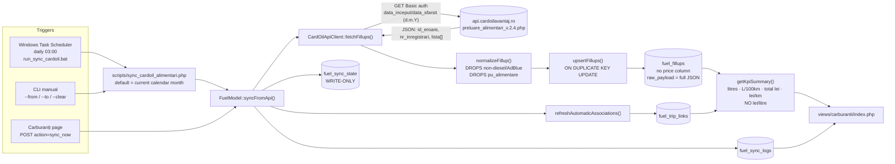
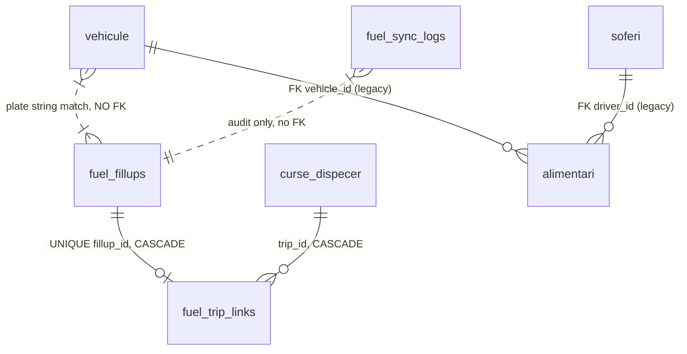
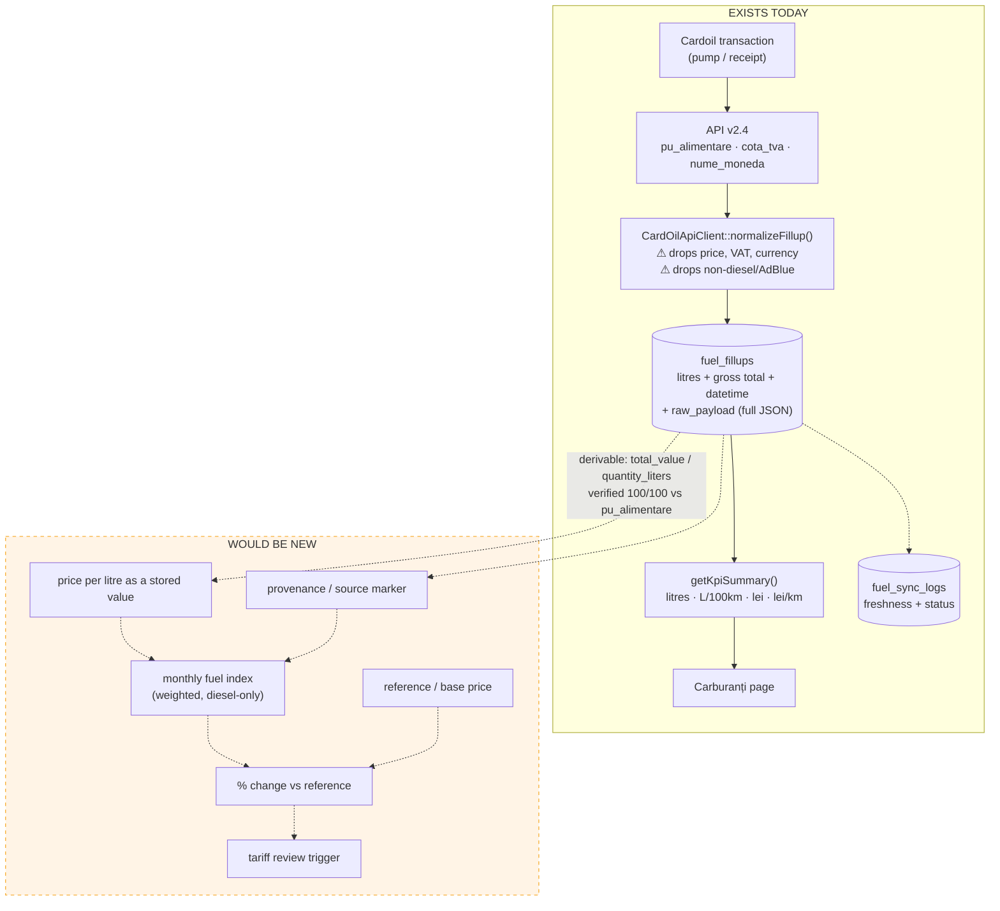

# ANALIZA_FUEL_API_TARIFARE.md

**Read-only reverse-engineering of the existing Fuel API integration and fuel-data lifecycle.**

| | |
|---|---|
| Repository | `C:\laragon\www\aplicatie_fleet` — branch `main` @ `2933432` |
| API documentation | *Cardoil Avantaj — Documentatie API — Preluare Alimentari v.2.4* (5 pages, supplied by the user) |
| Live database | MySQL `if0_41456552_aplicatie_flota`, inspected read-only (`SHOW CREATE TABLE`, `SELECT`) |
| Analysis date | 2026-08-18 |
| Changes made | **none** — no code, no schema, no data, no live API calls |

### Evidence legend

Every finding is tagged:

| Tag | Meaning |
|---|---|
| **[CODE]** | Confirmed by reading the repository source |
| **[DB]** | Confirmed by a read-only query against the live database |
| **[DOC]** | Confirmed by the official Cardoil v2.4 documentation |
| **[INFERRED]** | Reasoned from the above, not directly stated |
| **[UNKNOWN]** | Could not be established from code, database or documentation |

---

## 1. Executive Summary

The project integrates **one** external fuel API: **Cardoil Avantaj / GestCom OIL**, endpoint `preluare_alimentari_v.2.4.php`. The integration is a single-file HTTP client plus a model method, triggered manually from the *Carburanți* page or by a daily Windows Scheduled Task.

The ten findings that matter most:

1. **The API returns a unit price per litre (`pu_alimentare`, 4 decimals) and the application never reads it.** **[DOC]**+**[CODE]** `CardOilApiClient::normalizeFillup()` maps quantity and total value but has no mapping for `pu_alimentare`. `fuel_fillups` has **no price column**. Price per litre exists nowhere in the database.

2. **Price per litre is therefore only *derivable*, as `total_value / quantity_liters`.** I verified this reconstruction against the API's own `pu_alimentare` preserved in `raw_payload`: **100 of 100 real rows agree to within 0.005 lei, maximum deviation 0.000186 lei** **[DB]**. The derivation is accurate — but it is lossy (two `DECIMAL(12,2)` values reproducing a 4-decimal source) and it is not performed anywhere in the application today.

3. **No average fuel price of any kind exists in the codebase.** **[CODE]** A repository-wide search for `AVG(price)`, `SUM(cost)/SUM(litres)`, `pret_mediu`, `pret_litru`, `price_per_litre` returns nothing in the fuel module. The Carburanți KPIs are litres, L/100 km, total cost and cost/km — never lei/litre.

4. **Petrol, GPL and GNC transactions are silently discarded at ingest.** **[CODE]** `normalizeFuelType()` returns only `motorina` or `adblue`; anything else returns `null`, and `normalizeFillup()` then returns `null`, dropping the record entirely. `fuel_fillups.fuel_type` is `ENUM('motorina','adblue')`. The documented subcategories `BENZINA`, `GPL`, `GNC` **[DOC]** cannot be stored.

5. **Historical price observations do survive** — one row per transaction in `fuel_fillups`, with `fillup_datetime`, litres and total value **[DB]**. 108 rows spanning 2026-07-01 → 2026-08-25. So a monthly average *can* be reconstructed. This is the single most positive finding.

6. **…but the production table is contaminated.** 8 hand-inserted rows with `api_id LIKE 'test-compare-%'` and `raw_payload = {"source":"test-compare"}` sit alongside 100 real rows **[DB]**. They carry 2,275 litres and 15,694 lei, and no application filter distinguishes them.

7. **The contamination plus the fuel-type mixing changes the answer by a factor of 2.6.** **[DB]** July → August weighted price evolution computed exactly as the application would today (all rows, all fuel types) is **+5.65 %**; computed on real diesel only it is **+14.92 %**.

8. **Synchronisation is a full re-fetch of the current calendar month, by date range only.** **[CODE]** The documented `id_minim` / `id_maxim` cursors are never sent; `fuel_sync_state` stores the echoed metadata but is **write-only** (written at `FuelModel.php:1631`, never read).

9. **Corrections overwrite history in place with no trace.** **[CODE]** `ON DUPLICATE KEY UPDATE` on `uk_fuel_fillups_api_id` replaces litres, total value and `raw_payload`. Sync log #21 shows *received 42, inserted 0, **updated 42*** **[DB]** — a full overwrite of a month already stored.

10. **The data is stale and the scheduler appears not to be running.** Last successful sync: **2026-08-07 09:13:47**; latest real transaction: **2026-08-07 06:19:09** **[DB]**. Today is 2026-08-18 — 11 days with no sync. "August" currently means only 1–7 August.

---

## 2. External Fuel API

**Exactly one** fuel API exists in the project. **[CODE]**

| Property | Documentation **[DOC]** | Implementation **[CODE]** | Agreement |
|---|---|---|---|
| Provider | FRANCIZE CARDOIL AVANTAJ S.A. / GestCom OIL | `CardOilApiClient` | ✅ |
| Base URL | `https://api.cardoilavantaj.ro` | `.env` → `CARDOIL_API_BASE_URL=https://api.cardoilavantaj.ro` | ✅ |
| Endpoint | `/alimentari/preluare_alimentari_v.2.4.php` | `.env` → `CARDOIL_API_FILLUPS_ENDPOINT=/alimentari/preluare_alimentari_v.2.4.php` | ✅ |
| Method | `GET` | `.env` → `CARDOIL_API_METHOD=GET` | ✅ |
| Auth | Basic, `utilizator:api_key` | `Authorization: Basic base64(username:apiKey)` — `CardOilApiClient.php:79` | ✅ |
| Timeout | example uses 60 s connect + 60 s total | default **15 s**, clamped to `[3, 60]` — `CardOilApiClient.php:20` | ⚠ divergent |
| Max records/request | **1000**, caller must narrow params | **not handled** — no pagination, no check | ❌ divergent |
| Date span limit | **31 days**, else API error | **not enforced** client-side | ⚠ divergent |
| Cursors | `id_minim` / `id_maxim` | **never sent** | ❌ divergent |

⚠ The **code defaults** in `CardOilApiClient.php:17-18` (`https://cardoilavantaj.ro/api` + `/alimentari`) do **not** match the documented endpoint. They are corrected by `.env` in this deployment. **[CODE]** The sync log history shows the consequence of running without those overrides: entries #12 and #13 are `CardOil HTTP status 404` **[DB]**.

### 2.1 Documented vs implemented request parameters

**[DOC]** the API accepts `id_minim`, `id_maxim`, `data_inceput`, `data_sfarsit`, `cif_client`, and requires **at least one** of the first four.

**[CODE]** `CardOilApiClient::fetchFillups()` sends exactly two:

```php
$payload = [
    'data_inceput' => $dateFrom->format('d.m.Y'),
    'data_sfarsit' => $dateTo->format('d.m.Y'),
];
```
— `CardOilApiClient.php:39-42`

The `d.m.Y` format is explicitly listed as accepted **[DOC]** ("01.02.2025"). `cif_client` is never sent — correct for a single-company `CLIENT` account, and the live responses confirm `tip_utilizator` is not a group account (`nume_client: "LPG AUTO TRANS SRL"`, single `cif_client: 34846757`) **[DB]**.

---

## 3. Files and Architecture

### 3.1 Component inventory

| File | Class / function | Purpose | Called by | Reads | Writes |
|---|---|---|---|---|---|
| `htdocs/services/CardOilApiClient.php` | `CardOilApiClient::fetchFillups()` | HTTP call + response normalisation | `FuelModel::syncFromApi()` | env vars | — |
| " | `::request()` / `::get()` / `::postJson()` | transport (cURL, `file_get_contents` fallback) | `fetchFillups` | — | — |
| " | `::extractItems()` :186 | pulls the record array out of the envelope | `fetchFillups` | — | — |
| " | `::extractMeta()` :199 | pulls `nr_inregistrari`, `id_minim`… | `fetchFillups` | — | — |
| " | `::normalizeFillup()` :211 | **maps API fields → app fields** | `fetchFillups` | — | — |
| " | `::normalizeFuelType()` :319 | product → `motorina` \| `adblue` \| `null` | `normalizeFillup` | — | — |
| `htdocs/models/FuelModel.php` | `::ensureSchema()` :24 | runtime DDL for 4 tables | every public method | — | DDL |
| " | `::syncFromApi()` :132 | orchestrates one sync | controller + CLI | — | `fuel_sync_logs`, `fuel_sync_state` |
| " | `::upsertFillups()` :265 | INSERT … ON DUPLICATE KEY UPDATE | `syncFromApi` | — | `fuel_fillups` |
| " | `::refreshAutomaticAssociations()` :367 | fillup ↔ trip matching | sync + page load | `curse_dispecer` | `fuel_trip_links` |
| " | `::getKpiSummary()` :810 | the Carburanți KPI block | `getDashboardData` | `fuel_fillups`, `fuel_trip_links`, `curse_dispecer` | — |
| " | `::percentageChange()` :1559 | `((cur-prev)/prev)*100`, 1 dp | `buildComparisonMetrics` | — | — |
| " | `::getLastSyncLog()` :796 | freshness indicator | controller | `fuel_sync_logs` | — |
| " | `::storeSyncMeta()` :1624 | persists echoed API meta | `syncFromApi` | — | `fuel_sync_state` |
| " | `::buildDemoRecords()` :1647 | **fabricates fake fill-ups** | `syncFromApi` on failure | — | — |
| " | `::backfillDriverNamesFromRawPayload()` :1892 | mines `raw_payload.$.sofer_card` | `ensureSchema` | `fuel_fillups` | `fuel_fillups` |
| `htdocs/controllers/FuelController.php` | `::indexAction()` :39 | renders the page | router | model | — |
| " | `::syncNowAction()` :92 | **manual sync trigger** | POST `action=sync_now` | — | via model |
| " | `::linkFillupAction()` :122, `::setFullAction()` :152 | manual link / full-tank flag | POST | — | `fuel_trip_links`, `fuel_fillups` |
| `htdocs/views/carburanti/index.php` | — | KPIs, charts, tables, sync button | controller | — | — |
| `scripts/sync_cardoil_alimentari.php` | CLI entry point | headless sync | `.bat` | — | via model |
| `scripts/run_sync_cardoil.bat` | — | wraps the CLI, appends to log | Task Scheduler | — | `storage/logs/cardoil_sync.log` |
| `scripts/create_cardoil_task_scheduler.ps1` | — | registers the daily task | run once, manually | — | Windows Task Scheduler |
| `htdocs/index.php:555` | router | `case 'carburanti'` | — | — | — |
| `htdocs/config/permissions.php:74-82` | catalog | declares `carburanti.sync` as *sensitive* | — | — | — |

### 3.2 Legacy / orphan components

| Component | Status | Evidence |
|---|---|---|
| Table `alimentari` | **Legacy.** Has `pret_litru DECIMAL(10,2)`, `cardoil_id`, `raw_json`, `cardoil_synced_at`. **2 rows, 0 from CardOil.** No INSERT/UPDATE anywhere in the codebase — read-only from `DashboardModel.php:507` and `DriverActivityHistoryModel.php:338`. | **[DB]**+**[CODE]** |
| Table `cardoil_sync_state` | **Orphan.** Columns `last_sync_at`, `last_success_at`, `last_status`, `last_error`, `last_imported_id`. **Zero code references.** Last touched 2026-07-08 12:32:08. | **[DB]**+**[CODE]** |
| `FuelModel::buildDemoRecords()` | Live but disabled by `CARDOIL_DEMO_MODE=off`. Historically active — sync logs #10/#11 inserted 12 fabricated rows. | **[CODE]**+**[DB]** |

### 3.3 Architecture



---

## 4. Authentication and Configuration

### 4.1 Credentials

**[CODE]** `CardOilApiClient::__construct()` reads four environment variables via `getenv()`:

| Variable | Present in `.env`? | Value |
|---|---|---|
| `CARDOIL_USERNAME` | yes | *(non-secret account name; not reproduced here)* |
| `CARDOIL_API_KEY` | yes | `[REDACTED]` |
| `CARDOIL_API_BASE_URL` | yes | `https://api.cardoilavantaj.ro` |
| `CARDOIL_API_FILLUPS_ENDPOINT` | yes | `/alimentari/preluare_alimentari_v.2.4.php` |
| `CARDOIL_API_METHOD` | yes | `GET` |
| `CARDOIL_API_TIMEOUT` | **absent** → default **15 s** | — |
| `CARDOIL_DEMO_MODE` | yes | `off` |

`.env.example` documents all of them with placeholder values. **[CODE]**

### 4.2 Authentication mechanism

```php
'Authorization: Basic ' . base64_encode($this->username . ':' . $this->apiKey),
```
— `CardOilApiClient.php:79`

This matches the documented scheme exactly **[DOC]**: `-u 'utilizator:api_key'`, i.e. `Authorization: Basic base64_encode($utilizator.':'.$api_key)`. ✅

### 4.3 Guard when credentials are missing

**[CODE]** `credentialsAvailable()` (`:23`) returns false if either value is empty; `fetchFillups()` then returns `source = 'missing_credentials'` with an empty record set — it does **not** throw. `syncFromApi()` records status `missing_credentials` in `fuel_sync_logs`. The sync appears "completed with 0 records" rather than failed.

---

## 5. API Request Lifecycle

Traced end to end for one real record — id `12034274`, preserved in `raw_payload` **[DB]**.

```
Trigger: Task Scheduler 03:00  →  scripts/run_sync_cardoil.bat
   ↓
scripts/sync_cardoil_alimentari.php
   dateFrom = first day of this month, dateTo = last day of this month   (lines 58-61)
   ↓
FuelModel::syncFromApi($from, $to, new CardOilApiClient())               (FuelModel.php:132)
   ↓ ensureSchema()  — runtime CREATE TABLE IF NOT EXISTS × 4            (:24)
   ↓ createSyncLog() — INSERT fuel_sync_logs status='running'            (:1568)
   ↓
CardOilApiClient::fetchFillups()                                         (:29)
   payload = ['data_inceput' => '01.08.2026', 'data_sfarsit' => '31.08.2026']
   ↓ request() → get()                                                   (:74, :96)
   GET https://api.cardoilavantaj.ro/alimentari/preluare_alimentari_v.2.4.php
       ?data_inceput=01.08.2026&data_sfarsit=31.08.2026
   Headers: Accept/Content-Type: application/json
            Authorization: Basic [REDACTED]
   cURL: RETURNTRANSFER, FOLLOWLOCATION=true, CONNECTTIMEOUT=15, TIMEOUT=15
   ↓
HTTP 200 + JSON envelope
   ↓ json_decode(); non-array → RuntimeException 'Raspuns CardOil invalid sau non-JSON.'
   ↓ if id_eroare > 0 → RuntimeException(mesaj_eroare)                   (:50-54)
   ↓ extractItems() → $decoded['lista']                                  (:186)
   ↓ extractMeta()  → id_minim, id_maxim, data_inceput, data_sfarsit,
                      cif_client, nr_inregistrari                        (:199)
   ↓ foreach lista → normalizeFillup()                                   (:211)
       registration ← nrinmatric_card ("B 82 NET")   [eticheta_card fallback]
       fuel_type    ← nume_produs ("EURO L DIESEL") → normalizeFuelType → 'motorina'
       quantity     ← cantitate_alimentare ("35.56")
       datetime     ← data_alimentare + ora_alimentare ("2026-08-07" + "04:51:01")
       api_id       ← id_alimentare ("12034274")
       total_value  ← valoare_alimentare ("390.45")
       odometer_km  ← km_alimentare ("0")
       station_name ← nume_statie ("Gaiseni")
       driver_name  ← sofer_card ("GABY")
       raw_payload  ← the ENTIRE original item
       ⚠ pu_alimentare ("10.9800")  → NOT MAPPED
       ⚠ cota_tva ("21.00")          → NOT MAPPED
       ⚠ nume_moneda ("LEI")         → NOT MAPPED
       ⚠ clasa_produs ("STANDARD")   → NOT MAPPED
       ⚠ id_card, id_factura, sold_alimentare, cc1/cc2, nume_departament → NOT MAPPED
       (all of the above survive only inside raw_payload)
   ↓ null returned if registration=='' OR fuel_type===null
     OR quantity<=0 OR datetime===null  → RECORD SILENTLY DROPPED        (:255)
   ↓
FuelModel::upsertFillups()                                               (:265)
   SELECT id FROM fuel_fillups WHERE api_id = :api_id      (existence probe)
   INSERT INTO fuel_fillups (...) ON DUPLICATE KEY UPDATE (...)
   → row 855 in fuel_fillups
   ↓
refreshAutomaticAssociations()  → fuel_trip_links                        (:367)
storeSyncMeta()                 → fuel_sync_state (write-only)           (:1624)
finishSyncLog()                 → fuel_sync_logs status='success'        (:1601)
   ↓
views/carburanti/index.php  — KPI cards, charts, fill-up tables
```

---

## 6. Synchronization Trigger and Frequency

**Three** triggers exist. **[CODE]**

| # | Trigger | Mechanism | Date range | Guard |
|---|---|---|---|---|
| 1 | **Scheduled** | Windows Task Scheduler task *"FleetApp CardOil Sync"*, `-Daily -At 03:00`, running `scripts\run_sync_cardoil.bat` → `php scripts\sync_cardoil_alimentari.php`, output appended to `storage\logs\cardoil_sync.log` | **current calendar month** (first → last day) | none |
| 2 | **Manual, UI** | `POST ?page=carburanti&action=sync_now`, button on the Carburanți page | **current calendar month** — `FuelController::currentMonthInterval()` :343 | CSRF only |
| 3 | **Manual, CLI** | `php scripts/sync_cardoil_alimentari.php --from=… --to=… [--clear[=all]] [--no-demo]` | arbitrary | none |

**Not** triggered: page load. `indexAction()` calls `refreshAutomaticAssociations()` and `ensureSchema()` on every page view, but **never** the API. **[CODE]**

### 6.1 The scheduler is registered by hand, and is evidently not running

`create_cardoil_task_scheduler.ps1` is a **setup script that an operator must execute once**; nothing in the application registers or verifies the task. **[CODE]**

**[DB]** `fuel_sync_logs` — most recent entries:

| id | started | date_from | date_to | status | received | inserted | updated |
|---|---|---|---|---|---|---|---|
| 21 | 2026-08-07 09:13:47 | 2026-08-01 | 2026-08-31 | success | 42 | 0 | 42 |
| 20 | 2026-08-07 09:13:36 | 2026-08-01 | 2026-08-31 | success | 42 | 8 | 34 |
| 19 | 2026-08-06 12:27:14 | 2026-08-01 | 2026-08-31 | success | 34 | 34 | 0 |
| 18 | 2026-07-10 10:50:56 | 2026-07-01 | 2026-07-31 | success | 58 | 0 | 58 |

All timestamps are working hours (09:13, 12:27, 10:50) — **no 03:00 entry has ever been written**. **[INFERRED]** every sync to date was manual. Last sync: **2026-08-07**; today: **2026-08-18** → **11 days stale**.

### 6.2 A structural month-boundary gap

**[INFERRED]** from **[CODE]**: both automatic and UI triggers are hard-bound to the *current* month. Once the calendar rolls over, the previous month is never re-fetched. A transaction that Cardoil posts (or corrects) after the last run of month *M* is unreachable except by a manual CLI run with explicit `--from`/`--to`. Given that `id_factura` / `serie_factura` / `nr_factura` are `null` in every stored payload **[DB]** and are documented as populated **only after invoicing** **[DOC]**, late post-invoice updates are exactly the case this design misses.

---

## 7. API Response Structure

### 7.1 Envelope — documented vs consumed

| Field **[DOC]** | Meaning | Consumed? **[CODE]** |
|---|---|---|
| `id_eroare` | 0 = success, >0 = failure | ✅ checked, `:50` |
| `mesaj_eroare` | error cause | ✅ used as exception message, `:51` |
| `tip_utilizator` | CLIENT / MULTIFLOTA / GRUP | ❌ ignored |
| `id_minim`, `id_maxim` | echo of the requested ID cursors | ⚠ stored in `fuel_sync_state`, never read |
| `data_inceput`, `data_sfarsit` | echo of the requested dates | ⚠ same |
| `cif_client` | echo | ⚠ same |
| `nr_inregistrari` | **record count; ==1000 means truncated** | ⚠ stored, **never compared to 1000** |
| `lista[]` | the transactions | ✅ via `extractItems()` |

`extractItems()` tries `lista` first, then seven other key names (`data`, `alimentari`, `fillups`, `records`, `transactions`, `items`, `result`) — defensive generic code; only `lista` is documented and only `lista` occurs. **[CODE]**+**[DOC]**

### 7.2 Per-transaction fields — full mapping

`lista[]` carries **34 documented fields** **[DOC]**. The application consumes **9**.

| API field **[DOC]** | Documented meaning | → Application field **[CODE]** | → DB column **[DB]** | Business meaning |
|---|---|---|---|---|
| `id_alimentare` | unique fill-up ID | `api_id` | `fuel_fillups.api_id` **UNIQUE** | duplicate key |
| `nrinmatric_card` | plate on card *(optional)* | `vehicle_registration` (1st choice) | `fuel_fillups.vehicle_registration` | vehicle link |
| `eticheta_card` | printed card label | `vehicle_registration` (fallback) | " | vehicle link |
| `sofer_card` | driver on card *(optional)* | `driver_name` | `fuel_fillups.driver_name` | driver |
| `nume_produs` | product name | → `normalizeFuelType()` | `fuel_fillups.fuel_type` ENUM | fuel type |
| `cantitate_alimentare` | quantity | `quantity_liters` | `fuel_fillups.quantity_liters` `DEC(12,2)` | litres |
| `valoare_alimentare` | **value, VAT included** | `total_value` | `fuel_fillups.total_value` `DEC(12,2)` | gross lei paid |
| `data_alimentare` + `ora_alimentare` | transaction date + time *(from the receipt)* | `fillup_datetime` | `fuel_fillups.fillup_datetime` | **the price observation date** |
| `km_alimentare` | odometer at station *(optional)* | `odometer_km` | `fuel_fillups.odometer_km` INT | consumption calc |
| `nume_statie` | station name | `station_name` | `fuel_fillups.station_name` | station |
| **`pu_alimentare`** | **unit price, VAT included** | ❌ **NOT MAPPED** | ❌ **no column** | **lei/litre — see §9** |
| `cota_tva` | VAT percent | ❌ | raw only | VAT rate |
| `nume_moneda` | LEI / EUR / USD | ❌ | raw only | currency |
| `nume_subcategorie` | MOTORINA/BENZINA/GPL/GNC/ADBLUE | ⚠ 8th fallback, in practice unused | raw only | product family |
| `nume_categorie` | Combustibil/Magazin/Discount/Adaos | ⚠ 9th fallback, unused | raw only | **discount rows** |
| `clasa_produs` | STANDARD / PREMIUM | ❌ | raw only | fuel grade |
| `id_card` | unique card ID | ❌ | raw only | fuel card |
| `card_unic` | DA / NU | ❌ | raw only | — |
| `id_factura`, `serie_factura`, `nr_factura` | invoice, **only after invoicing** | ❌ | raw only | invoice link |
| `sold_alimentare` | fleet balance after transaction | ❌ | raw only | — |
| `id_statie`, `tip_statie`, `nume_furnizor` | station/supplier detail | ⚠ `nume_furnizor` is a `station_name` fallback | raw only | — |
| `tip_vehicul`, `cc1_card`, `cc2_card`, `nume_departament` | card metadata *(optional)* | ❌ | raw only | — |
| `nume_francizat`, `cif_francizat`, `id_client`, `nume_client`, `cif_client`, `id_flota` | account identity | ❌ | raw only | — |
| `um_produs` | LITRI / BUC. | ❌ | raw only | **unit — never validated** |

**Every unmapped field is nonetheless preserved verbatim in `fuel_fillups.raw_payload`** **[CODE]** `upsertFillups()` :331-352 — which is what makes the verification in §29 possible.

### 7.3 Documentation vs live data — divergences

> **Documentation says:** `cota_tva` — "cota TVA (procent: 0, 5, 9 sau 19)"
> **Live data shows:** `cota_tva` = `"21.00"` on **100 of 100** real rows **[DB]**
> **Impact:** the documentation predates the Romanian VAT change. Any future net/gross conversion that hard-codes 19 % from the documentation would be wrong. The rate must be read from the payload.
> **Evidence:** `SELECT JSON_UNQUOTE(JSON_EXTRACT(raw_payload,'$.cota_tva')) … GROUP BY 1` → single value `21.00`.

> **Documentation says:** `um_produs` — "unitate de masura a produsului/articolului (LITRI, BUC.)"
> **Implementation does:** never reads `um_produs`; `cantitate_alimentare` is written into `quantity_liters` unconditionally.
> **Impact:** a `BUC.` (piece) line — documented as possible, and inevitable for `Magazin` category items — would be stored as if it were litres. Currently harmless because only `Combustibil` rows survive the fuel-type filter, but the guard is incidental, not deliberate.
> **Evidence:** `CardOilApiClient.php:236-244` (quantity keys) vs `:319` (`normalizeFuelType`).

> **Documentation says:** max 1000 records per request; if `nr_inregistrari == 1000`, narrow the parameters and re-request.
> **Implementation does:** stores `nr_inregistrari` in `fuel_sync_state` and never inspects it. No pagination loop exists.
> **Impact:** silent truncation once a month exceeds 1000 transactions. Current volume is 42–58/month **[DB]**, so ~17× headroom — a latent, not active, defect.
> **Evidence:** `CardOilApiClient::extractMeta()` :199; `FuelModel::storeSyncMeta()` :1624; no reader anywhere.

---

## 8. Fuel Transaction Data Model

**[DB]** live schema:

```sql
CREATE TABLE `fuel_fillups` (
  `id`                   int unsigned NOT NULL AUTO_INCREMENT,
  `api_id`               varchar(160)  NOT NULL,          -- = id_alimentare
  `vehicle_registration` varchar(40)   NOT NULL,          -- plate STRING, no FK
  `driver_name`          varchar(180)  DEFAULT NULL,
  `fuel_type`            enum('motorina','adblue') NOT NULL,
  `quantity_liters`      decimal(12,2) NOT NULL DEFAULT '0.00',
  `odometer_km`          int unsigned  DEFAULT NULL,
  `total_value`          decimal(12,2) NOT NULL DEFAULT '0.00',   -- GROSS, VAT included
  `station_name`         varchar(180)  DEFAULT NULL,
  `fillup_datetime`      datetime      NOT NULL,          -- data + ora alimentare
  `is_full`              tinyint(1)    NOT NULL DEFAULT '0',
  `raw_payload`          longtext      DEFAULT NULL,      -- FULL original JSON
  `created_at`           datetime      NOT NULL,          -- import time
  `updated_at`           datetime      NOT NULL,
  PRIMARY KEY (`id`),
  UNIQUE KEY `uk_fuel_fillups_api_id` (`api_id`),
  KEY `idx_fuel_fillups_vehicle_datetime` (`vehicle_registration`,`fillup_datetime`),
  KEY `idx_fuel_fillups_fuel_type` (`fuel_type`),
  KEY `idx_fuel_fillups_full` (`vehicle_registration`,`fuel_type`,`is_full`,`fillup_datetime`)
) ENGINE=InnoDB AUTO_INCREMENT=907
```

**There is no price column, no currency column, no VAT column, no source column and no correction history.**

---

## 9. Price-per-Litre Origin

This is the decisive question for any future indexation, so it is answered against all three sources.

### 9.1 The answer

Against the multiple-choice framing in the brief:

| Option | Verdict |
|---|---|
| **A** — directly returned by the API | **The API does return it** (`pu_alimentare`, 4 decimals) — **but the application never reads or stores it.** |
| **B** — calculated as total / litres | **This is the only route available today**, and it is **not implemented anywhere**. |
| **C** — read from an invoice | No. Invoice fields are `null` in every stored payload **[DB]** and unmapped **[CODE]**. |
| **D** — stored manually | Only in the dead `alimentari` table (2 rows) — see §9.4. |
| **E** — derived from another source | No. |
| **F** — combination by transaction type | No. |

**Conclusion: price per litre exists in the API response, is discarded at ingest, is absent from the database schema, and is computed nowhere in the application.** It is *reconstructible* — accurately — but only by dividing two stored columns, or by extracting `raw_payload.$.pu_alimentare`.

### 9.2 Evidence — the API returns it

**[DOC]** field list: `pu_alimentare` — "pret unitar al produsului (include TVA)"; and the explicit note: *"Campurile pu_alimentare si valoare_alimentare include TVA"*.

**[DB]** live payload, `fuel_fillups.id = 855`:
```json
"nume_produs":"EURO L DIESEL","nume_subcategorie":"MOTORINA","clasa_produs":"STANDARD",
"cota_tva":"21.00","cantitate_alimentare":"35.56","um_produs":"LITRI",
"pu_alimentare":"10.9800","valoare_alimentare":"390.45","nume_moneda":"LEI"
```

### 9.3 Evidence — the application discards it

**[CODE]** `CardOilApiClient::normalizeFillup()` :211-296 returns an array with keys `api_id`, `vehicle_registration`, `driver_name`, `fuel_type`, `quantity_liters`, `odometer_km`, `total_value`, `station_name`, `fillup_datetime`, `is_full`, `raw_payload`. There is no unit-price key, and `firstNumber()` is never called with `pu_alimentare` — the string `pu_alimentare` appears **nowhere** in the repository outside `raw_payload` data.

`FuelModel::upsertFillups()` :279-305 lists 13 INSERT columns; none is a price. `ensureSchema()` :31-49 defines the table without one.

### 9.4 The one place a `pret_litru` derivation does exist — on a dead table

**[CODE]** `DriverActivityHistoryModel::decorateFuelRow()` :912-920:

```php
$price = $row['pret_litru'] ?? null;
if (($price === null || $price === '' || (float) $price <= 0) && (float) ($row['litri'] ?? 0) > 0) {
    $price = (float) ($row['cost_total'] ?? 0) / (float) $row['litri'];
}
$row['pret_litru_calculat'] = $price !== null ? (float) $price : null;
```

Displayed at `views/driver_activity_history/index.php:305`, exported at `DriverActivityHistoryController.php:102`.

**But it reads `alimentari`, not `fuel_fillups`** (`DriverActivityHistoryModel.php:338`), and **[DB]** `alimentari` holds **2 rows, both from June 2026, neither imported from CardOil** (`cardoil_id IS NULL` for both). This logic is therefore effectively dead — **it operates on a table the Cardoil integration does not write to.**

### 9.5 Verification of the derivation — 100/100 exact

Because `raw_payload` preserves the authoritative `pu_alimentare`, the derived price can be checked against it. **[DB]**

```sql
SELECT COUNT(*) n,
       SUM(ABS(derivat - api_pu) < 0.005)  potrivite,
       ROUND(MAX(ABS(derivat - api_pu)),6) max_diferenta
FROM (SELECT total_value/quantity_liters AS derivat,
             CAST(JSON_UNQUOTE(JSON_EXTRACT(raw_payload,'$.pu_alimentare')) AS DECIMAL(12,4)) AS api_pu
      FROM fuel_fillups
      WHERE raw_payload LIKE '%pu_alimentare%' AND quantity_liters > 0) t;
```

| n | potrivite | max_diferenta |
|---|---|---|
| **100** | **100** | **0.000186** |

`total_value / quantity_liters` reproduces the API's own unit price for **every** real record, with a worst-case error of 0.000186 lei/litre. **[CONFIRMED FROM DATABASE]**

The residual error is the expected consequence of reconstructing a 4-decimal source from two 2-decimal stored values. It is immaterial at 2 dp but it is a genuine, permanent precision loss — the exact figure can only be recovered from `raw_payload`, not from the typed columns.

---

## 10. Fuel Types and Product Mapping

### 10.1 The normalisation function

**[CODE]** `CardOilApiClient::normalizeFuelType()` :319-334 — the complete implementation:

```php
if (str_contains($normalized, 'adblue') || str_contains($normalized, 'ad blue')) return 'adblue';
if (str_contains($normalized, 'motorina') || str_contains($normalized, 'diesel')
    || str_contains($normalized, 'gazole')) return 'motorina';
return null;                    // ← everything else
```

and in `normalizeFillup()` :255:

```php
if ($registration === '' || $fuelType === null || $quantity <= 0.0 || $datetime === null) {
    return null;                // ← record dropped, never reaches the database
}
```

The source string is `firstString($payload, [... 'nume_produs', 'nume_subcategorie', 'nume_categorie'])`; for a Cardoil payload the first key present is **`nume_produs`** — the free-text commercial product name, not the structured `nume_subcategorie`. **[CODE]**+**[DB]**

### 10.2 Mapping table

| API value (`nume_subcategorie`) **[DOC]** | Example `nume_produs` **[DB]** | Internal value **[CODE]** | DB representation | Display label | Status |
|---|---|---|---|---|---|
| `MOTORINA` | `EURO L DIESEL` | `motorina` | `fuel_type='motorina'` | "Motorină" | ✅ stored — 89 rows |
| `AdBlue` / `ADBLUE` | `AdBlue` | `adblue` | `fuel_type='adblue'` | "AdBlue" | ✅ stored — 11 rows |
| `BENZINA` | `EURO LUK BENZINA COR 95 BIO` *(doc example)* | `null` | — | — | ❌ **DROPPED** |
| `GPL` | — | `null` | — | — | ❌ **DROPPED** |
| `GNC` | — | `null` | — | — | ❌ **DROPPED** |
| *(category `Magazin`)* | shop articles | `null` | — | — | ❌ dropped *(correctly)* |
| *(category `Discount`)* | discount lines | `null` | — | — | ❌ dropped — see §19.3 |
| *(category `Adaos`)* | surcharge lines | `null` | — | — | ❌ dropped |

**[DB]** live distribution across all 100 real rows:

| `nume_subcategorie` | `nume_categorie` | `cota_tva` | `nume_moneda` | rows |
|---|---|---|---|---|
| MOTORINA | Combustibil | 21.00 | LEI | 89 |
| AdBlue | Combustibil | 21.00 | LEI | 11 |

Only two products have ever been received. `clasa_produs` is `STANDARD` for diesel, `null` for AdBlue **[DB]**.

### 10.3 The brittleness

**[INFERRED]** The classifier depends on substring matching against a **free-text marketing name**, while the API supplies a **structured `nume_subcategorie`** field intended for exactly this purpose. `EURO L DIESEL` classifies only because it happens to contain "diesel". A supplier renaming the product (e.g. to `EURO L DSL`) would cause every diesel transaction to be silently dropped, with no error, no log entry, and `records_received` simply falling — indistinguishable from a quiet month.

---

## 11. Database Structure

### 11.1 `fuel_fillups` — the fuel transaction store

Full DDL in §8. Key points for indexation work:

| Aspect | Value |
|---|---|
| PK | `id` |
| UNIQUE | `api_id` (= `id_alimentare`) — the duplicate guard |
| FK | **none** — `vehicle_registration` is a free string |
| Indexes | `(vehicle_registration, fillup_datetime)`, `(fuel_type)`, `(vehicle_registration, fuel_type, is_full, fillup_datetime)` |
| **No index on `fillup_datetime` alone** | monthly range scans cannot use a leading-column index |
| Precision | litres `DECIMAL(12,2)`, value `DECIMAL(12,2)`, odometer `INT UNSIGNED` |
| Rows | **108** (100 real + 8 test) |

### 11.2 `fuel_trip_links`

```
id · fillup_id → fuel_fillups(id) CASCADE · trip_id → curse_dispecer(id) CASCADE
match_type ENUM('automatic','manual') · confidence DECIMAL(5,2) · created_at
UNIQUE (fillup_id)   ← one trip per fill-up
```

### 11.3 `fuel_sync_logs` — the audit trail

```
id · sync_started_at · sync_finished_at · date_from DATE · date_to DATE
status VARCHAR(30) · records_received · records_inserted · records_updated · error_message TEXT
INDEX (sync_started_at), INDEX (status)
```
21 rows **[DB]**. Statuses observed: `success`, `error`, `demo`, (`running`, `missing_credentials` reachable in code).

### 11.4 `fuel_sync_state` — write-only

```
state_key VARCHAR(80) PK · state_value VARCHAR(255) · updated_at
```
**[DB]** current contents:

| state_key | state_value | updated_at |
|---|---|---|
| `cardoil_data_inceput` | 2026-08-01 00:00:00 | 2026-08-07 09:13:47 |
| `cardoil_data_sfarsit` | 2026-08-31 00:00:00 | 2026-08-07 09:13:47 |
| `cardoil_nr_inregistrari` | 44 | 2026-08-07 09:13:47 |

Written by `FuelModel::storeSyncMeta()` :1624. **No SELECT against this table exists in the repository.** **[CODE]**

Note `nr_inregistrari = 44` while `fuel_sync_logs.records_received = 42` for the same run — **2 records were dropped by `normalizeFillup()`** and nothing recorded that. **[DB]**+**[INFERRED]**

### 11.5 `cardoil_sync_state` — orphan

```
id · last_sync_at · last_success_at · last_status · last_error
last_imported_id · imported_count · last_imported_batch · last_existing_batch · updated_at
```
1 row, `last_success_at = 2026-07-08 12:32:08`, `last_imported_id = 11926265`. **Zero code references** **[CODE]**. A remnant of an earlier ID-cursor design that was replaced by the date-range approach.

### 11.6 `alimentari` — legacy manual table

Relevant columns: `cardoil_id BIGINT UNSIGNED UNIQUE`, **`pret_litru DECIMAL(10,2)`**, `litri DECIMAL(8,2)`, `cost_total DECIMAL(10,2)`, `data_alimentare DATE`, `cardoil_alimentare_at DATETIME`, `cardoil_fuel_type VARCHAR(120)`, `cardoil_balance_after`, `raw_json LONGTEXT`, `cardoil_synced_at DATETIME`, `full_flag`, `km_bord`, `km_alimentare`, FK → `vehicule`, FK → `soferi`.

**[DB]** 2 rows, `cardoil_id IS NULL` on both, dates 2026-06-01 / 2026-06-02.
**[CODE]** read at `DashboardModel.php:507` and `DriverActivityHistoryModel.php:338`; **no INSERT or UPDATE anywhere**.

**Note the irony worth recording:** the *abandoned* table has a dedicated `pret_litru` column and a `raw_json`/`cardoil_synced_at` design; the *active* table has neither.

### 11.7 Relationships



---

## 12. Historical Data Behaviour

### 12.1 Are historical price observations stored? — YES, implicitly

**[DB]** Each API transaction becomes one immutable-until-corrected row carrying everything needed to reconstruct a price observation:

| Required element | Column | Present |
|---|---|---|
| table | `fuel_fillups` | ✅ |
| primary key | `id` (+ `api_id` UNIQUE) | ✅ |
| transaction date | `fillup_datetime` | ✅ |
| fuel type | `fuel_type` (2 values only) | ⚠ partial |
| price/litre | — | ❌ **derivable only** |
| litres | `quantity_liters` | ✅ |
| total | `total_value` | ✅ |
| station | `station_name` | ✅ |
| vehicle / card | `vehicle_registration` (string); card id in `raw_payload` only | ⚠ partial |

So the system does **not** keep merely a "current fuel price" — it keeps the full per-transaction series. Reconstruction of a historical monthly average **is** possible.

### 12.2 Available historical depth

**[DB]**

| Metric | Value |
|---|---|
| Earliest transaction | **2026-07-01 11:46:03** |
| Latest **real** transaction | **2026-08-07 06:19:09** |
| Latest row overall (test data) | 2026-08-25 10:45:00 |
| Distinct months | **2** (July, August 2026) |
| Total rows | 108 (100 real + 8 test) |
| Distinct vehicles | 34 |

Per month:

| Month | rows | litres | value (lei) |
|---|---|---|---|
| 2026-07 | 58 | 11,099.89 | 104,674.72 |
| 2026-08 | 50 | 10,644.48 | 106,053.83 |

**⚠ Two months is the entire history, and August covers only 1–7 August** in real data. There is no year-over-year, no seasonal baseline, and no complete second month.

### 12.3 What is *not* preserved

| Concept | Status |
|---|---|
| Price observation as a first-class record | ❌ derivable only |
| Correction history (before/after) | ❌ overwritten in place — §14 |
| Which sync produced a row | ❌ no `sync_log_id` on `fuel_fillups` |
| Source marker (API / demo / manual / test) | ❌ **none** — §13.3 |
| Currency, VAT rate, unit price as typed columns | ❌ `raw_payload` only |

---

## 13. Synchronization / Duplicate Logic

### 13.1 Strategy: **full re-fetch of a date window** — not incremental

**[CODE]** No cursor is used. `fetchFillups()` sends only `data_inceput` / `data_sfarsit`; the documented `id_minim` / `id_maxim` cursors are never populated. Each run re-downloads the entire current month and re-writes every row.

**[DB]** confirmed by the log pattern: run #19 inserted 34/received 34; run #20 received 42 → inserted 8, updated 34; run #21 received 42 → inserted 0, **updated 42**.

| Question | Answer | Evidence |
|---|---|---|
| Cursor used | none — date range only | `CardOilApiClient.php:39-42` |
| Pagination | none | no loop in `fetchFillups()` |
| How duplicates are prevented | `UNIQUE KEY uk_fuel_fillups_api_id` + `ON DUPLICATE KEY UPDATE` | `FuelModel.php:36`, `:307` |
| How existing rows are updated | all 9 data columns + `raw_payload` + `updated_at` overwritten | `FuelModel.php:307-318` |
| How new rows are detected | pre-flight `SELECT id … WHERE api_id` purely to classify insert vs update in the counters | `FuelModel.php:274`, `:334-337` |

### 13.2 Duplicate protection — sound for API data

`api_id` = `id_alimentare`, documented as "ID unic alimentare" **[DOC]**, enforced `UNIQUE` at database level **[DB]**. Re-running the same window any number of times cannot create duplicates. ✅

**Weakness [CODE]:** when `id_alimentare` is absent, `normalizeFillup()` :263 synthesises

```php
$apiId = 'cardoil-' . sha1($registration.'|'.$fuelType.'|'.$quantity.'|'.$datetime->format('Y-m-d H:i:s'));
```

This hash **includes the quantity**. A corrected quantity on an ID-less record would produce a different hash → a **second row**, i.e. a duplicated transaction. Currently latent: every observed real record carries `id_alimentare` **[DB]**.

### 13.3 The real duplicate/contamination problem: unmarked non-API rows

**[DB]** `fuel_fillups` contains three provenances with **no column to tell them apart**:

| Provenance | Identified by | rows | litres | value |
|---|---|---|---|---|
| Real API | `raw_payload LIKE '%pu_alimentare%'` | 100 | 20,469 | 195,034.55 |
| **Hand-inserted test** | `api_id LIKE 'test-compare-%'`, `raw_payload = {"source":"test-compare"}` | **8** | **2,275** | **15,694.00** |
| Demo (historical) | `api_id LIKE 'demo-cardoil-%'` | 0 now; 12 inserted historically (logs #10, #11) | — | — |

The 8 test rows carry suspiciously round values (340 L / 2363.00, 350 L / 2415.00 → exactly 6.95 and 6.90 lei/L) and dates up to **2026-08-25 — in the future relative to today**. They are indistinguishable from production data to every query in the application.

---

## 14. API Correction Behaviour

### 14.1 Actual behaviour: silent in-place overwrite

**[CODE]** `FuelModel::upsertFillups()` :307-318:

```sql
ON DUPLICATE KEY UPDATE
    vehicle_registration = VALUES(vehicle_registration),
    driver_name          = VALUES(driver_name),
    fuel_type            = VALUES(fuel_type),
    quantity_liters      = VALUES(quantity_liters),
    odometer_km          = VALUES(odometer_km),
    total_value          = VALUES(total_value),
    station_name         = VALUES(station_name),
    fillup_datetime      = VALUES(fillup_datetime),
    is_full              = VALUES(is_full),
    raw_payload          = VALUES(raw_payload),
    updated_at           = VALUES(updated_at)
```

Answering the scenario in the brief (100 L @ 7.20 → corrected to 102 L @ 7.18):

| Behaviour | Verdict |
|---|---|
| Updates the existing row | ✅ **this is what happens** — provided the correction falls inside the re-synced current month |
| Creates another row | ❌ no (unless the ID-less hash path applies — §13.2) |
| Ignores the change | ❌ no |
| Duplicates the transaction | ❌ no |

### 14.2 What is lost

- **The previous values are destroyed**, including the previous `raw_payload`. No before/after, no version, no correction log. `updated_at` moves; nothing records *what* changed.
- `fuel_sync_logs.records_updated` counts corrections **and** unchanged re-writes identically — run #21 reports "42 updated" where in reality 0 values may have changed. The counter cannot distinguish a correction from a no-op.
- **Corrections outside the current month are never seen** (§6.2). Given that invoice fields populate only after invoicing **[DOC]**, and invoicing typically lags the month, this is the likely case in practice.

**[INFERRED]** A July price corrected in mid-August would be invisible to this system unless someone manually runs the CLI with `--from=2026-07-01 --to=2026-07-31`.

---

## 15. Existing Fuel Page and KPIs

Page: `?page=carburanti` → `FuelController::indexAction()` → `views/carburanti/index.php`. **[CODE]**

### 15.1 KPI cards

**[CODE]** `FuelModel::getKpiSummary()` :810-853 — the complete set:

| KPI | Formula | Source columns | lei/litre? |
|---|---|---|---|
| Motorină consumată | `SUM(quantity_liters) WHERE fuel_type='motorina'` | `fuel_fillups.quantity_liters` | no |
| AdBlue consumat | `SUM(quantity_liters) WHERE fuel_type='adblue'` | " | no |
| **Cost total carburant** | `SUM(total_value)` — **all fuel types together** | `fuel_fillups.total_value` | no |
| Consum mediu motorină | `(motorina_liters / km) × 100`, rounded 2 | litres + odometer/trip km | no |
| Consum mediu AdBlue | `(adblue / motorina) × 100`, rounded 2 | litres | no |
| Km parcurși | odometer between full tanks, else linked-trip km | `odometer_km` / `curse_dispecer` | no |
| **Cost pe km** | `total_value / linked_km`, rounded 2 | `buildComparisonMetrics()` :691-694 | no |

**No KPI divides money by litres.** The nearest thing is *cost per km*.

### 15.2 Km source cascade

**[CODE]** :832-840 — primary source is odometer deltas between consecutive full tanks (`getOdometerConsumptionSummary()`); if that yields nothing, it falls back to km from linked dispatcher trips (`getDistinctLinkedKm()`), and `consumption_km_source` records which was used (`'alimentari'` vs `'dispecer'`).

### 15.3 Other page sections

Daily consumption chart, transport-type breakdown, normative interval, per-vehicle comparison cards, per-vehicle daily charts, A/B period comparison, latest fill-ups table, unassociated fill-ups, trip/transport consumption tables, **sync log table + last-sync indicator** (`getSyncLogs()` :781, `getLastSyncLog()` :796). **[CODE]**

### 15.4 Filters

**[CODE]** `buildFillupWhere()` :1480-1541 — date range on **`f.fillup_datetime`**, vehicle (space-insensitive plate matching), `fuel_type ∈ {motorina, adblue}`, transport group (via `fuel_trip_links` → `curse_dispecer.tip_transport`).

**Fuel-type filtering therefore already exists at the query level** — a necessary precondition for a diesel-only average.

---

## 16. Existing Average Price Logic

### **There is none.** **[CODE]** — CONFIRMED FROM CODE

A repository-wide search for the concepts named in the brief:

```
pret_litru | price_per_lit | pret_mediu | avg_price | unit_price
pu_alimentare | AVG( … price … ) | SUM(cost)/SUM(litres)
```

returns, in the fuel module: **nothing**. The only `AVG(` calls in the codebase are `DispecerCurseModel` (load factor) and `MaintenanceModel` (immobilisation days) — unrelated. The only `pret_litru` reference is the dead-table logic at `DriverActivityHistoryModel.php:914` (§9.4).

Consequently the simple-vs-weighted question in the brief **has no current answer to report** — neither is implemented.

### 16.1 What the two definitions would produce on real data

Computed read-only for reference **[DB]**:

| Scope | Month | Weighted `SUM(value)/SUM(litres)` | Arithmetic `AVG(value/litres)` | rows |
|---|---|---|---|---|
| **All rows, all fuel types** *(the naive query)* | 2026-07 | **9.4302** | 9.0440 | 58 |
| " | 2026-08 | **9.9633** | 9.7830 | 50 |
| **Real diesel only** | 2026-07 | **9.5057** | 9.5043 | 51 |
| " | 2026-08 | **10.9242** | 10.9129 | 38 |

Two things follow:

1. **Weighted vs arithmetic is a minor difference here** (9.5057 vs 9.5043 = 0.015 %) because Cardoil fill volumes are relatively uniform. It is not currently the dominant error term.
2. **Scope is the dominant error term.** Mixing AdBlue with diesel, and test rows with real rows, moves the August figure from 10.9242 to 9.9633 — an **8.8 % understatement**.

### 16.2 The compounding effect on a period-over-period comparison

| Basis | July | August | Change |
|---|---|---|---|
| All rows, all fuel types | 9.4302 | 9.9633 | **+5.65 %** |
| Real diesel only | 9.5057 | 10.9242 | **+14.92 %** |

**The same two months yield +5.65 % or +14.92 % — a factor of 2.6 — depending purely on filtering hygiene.** **[DB]** This is the most consequential quantitative finding in this report.

*(Caveat: the August figure covers 1–7 August only — see §21.)*

---

## 17. Monthly Aggregation Capability

**Existing monthly aggregation: NO.** **[CODE]**

A search for `GROUP BY YEAR(`, `GROUP BY MONTH(`, `DATE_FORMAT(` over the fuel module returns nothing. `getDailyConsumptionChart()` :988 groups by **day** within the selected range; period comparison (`previousPeriodFilters()` :1543) shifts by an equal number of **days**, not by calendar month.

**Technically achievable: YES** — the raw material is present. **[DB]** demonstration:

```sql
SELECT DATE_FORMAT(fillup_datetime,'%Y-%m') AS luna,
       ROUND(SUM(total_value)/SUM(quantity_liters), 4) AS pret_ponderat
FROM fuel_fillups
WHERE fuel_type = 'motorina'
GROUP BY 1;
```

| Requirement | Status |
|---|---|
| Source | `fuel_fillups` |
| Formula | `SUM(total_value) / SUM(quantity_liters)` |
| Fuel-type filtering | available via `fuel_type` — **but only diesel/AdBlue exist** |
| Date field | `fillup_datetime` (transaction date, correct — §18) |
| Provenance filtering | ❌ **not available** — no source column |
| Index support | ❌ no leading index on `fillup_datetime` |

---

## 18. Date Semantics

### 18.1 Which dates exist

| Date | Source | Stored? | Meaning |
|---|---|---|---|
| `data_alimentare` + `ora_alimentare` | API | ✅ → `fillup_datetime` | **"data tranzactie alimentare (data de pe bon)"** **[DOC]** — the receipt date |
| import time | app | ✅ → `created_at` | when first written |
| last write | app | ✅ → `updated_at` | when last overwritten |
| sync window | app | ✅ → `fuel_sync_logs.date_from` / `date_to` | which window was requested |
| invoice date | — | ❌ | `id_factura`/`serie_factura`/`nr_factura` unmapped and `null` in all live data |
| authorization / settlement date | — | ❌ | **not offered by the API** **[DOC]** |

### 18.2 The date used

**[CODE]** every fuel query filters on `f.fillup_datetime` (`buildFillupWhere()` :1482-1487). **[CONFIRMED]**

This is the **correct** choice for period attribution: it is the pump/receipt date, not the import date. A July transaction imported in August retains `fillup_datetime` in July and is attributed to July. The scenario raised in the brief is handled correctly by the date semantics.

⚠ The residual risk is not the date field but the **sync window** (§6.2): a July transaction imported in August is only attributed correctly **if it is ever imported at all**, and the automatic trigger stops looking at July on 1 August.

**No timezone handling exists** — `data_alimentare`/`ora_alimentare` are parsed as naive local time **[CODE]** `normalizeDateTime()` :338. Acceptable for a single-country fleet; recorded for completeness.

---

## 19. VAT / Discounts / Currency

### 19.1 VAT — **gross, VAT included**

> **Documentation says:** *"Campurile pu_alimentare si valoare_alimentare include TVA"* and `cota_tva` = "cota TVA (procent: 0, 5, 9 sau 19)". **[DOC]**
> **Implementation does:** stores `valoare_alimentare` into `total_value` unchanged; never reads `cota_tva`; performs no net/gross conversion.
> **Impact:** `fuel_fillups.total_value` — and therefore any derived lei/litre — is **gross (VAT-inclusive)**. Any comparison across a period in which the VAT rate changes would conflate a tax change with a fuel-price change.
> **Evidence:** `CardOilApiClient.php:274-282`; `FuelModel.php:346`; **[DB]** all 100 rows `cota_tva = "21.00"`.

The live rate (21 %) contradicts the documented enumeration (0/5/9/19) — see §7.3. **This is directly relevant**: Romania's VAT rate changed within the very window this data covers, and the stored figures carry no VAT column to detect it. Whether the tariff comparison should use gross or net is a **business question that the code cannot answer**.

| Question | Answer |
|---|---|
| Gross with VAT? | **YES** — documented and confirmed |
| Net without VAT? | no |
| Discounted fleet price or pump/list price? | **See §19.3 — cannot be determined** |
| Actual price paid? | see §19.3 |

### 19.2 Currency

| Aspect | Finding |
|---|---|
| Returned by API | `nume_moneda` — documented values LEI, EUR, USD **[DOC]** |
| Stored by application | ❌ **not stored** — `nume_moneda` is unmapped; `raw_payload` only |
| Conversion logic | ❌ none exists |
| Actual live data | **100/100 rows = `LEI`** **[DB]** |
| Assumed? | **Yes, implicitly.** The page labels every value "lei" (`views/carburanti/index.php:34`) with no currency check. |

**[INFERRED]** A EUR or USD transaction — which the API explicitly permits — would be summed into `total_value` as if it were lei, silently corrupting both the cost KPI and any derived price. No guard exists.

### 19.3 Discounts — **the open question**

**[DOC]** `nume_categorie` can be `Combustibil`, `Magazin`, **`Discount`**, **`Adaos`**. And: `id_card` — *"nu apare pe tranzactiile de discount/adaos"* — discount and surcharge lines are **separate rows without a card ID**.

**[CODE]** Such rows would carry `nume_produs` of a discount/surcharge, which `normalizeFuelType()` cannot classify → `null` → **dropped**. They would also fail the `registration !== ''` test, since they have no card.

**[DB]** No `Discount` or `Adaos` row exists in the current data — all 100 are `Combustibil`.

**Therefore:**

| Question | Answer |
|---|---|
| Do fleet-card discounts exist in the API data? | **UNKNOWN** — documented as a possible row category; **never observed** in this account's data |
| Which price does the application store? | The `Combustibil` line's own `valoare_alimentare` — i.e. the transaction as billed on that line |
| Is that the pump price or the net-of-discount price? | **UNKNOWN.** If Cardoil applies discounts as separate `Discount` rows, then the stored price is the **pump/list price** and the true net cost is lower. If the discount is already embedded in `pu_alimentare`, it is the **paid price**. **The code, the database and the documentation together cannot resolve this.** |

**[UNKNOWN] — flagged as an open business question**, exactly as the brief requires. It can only be settled by asking Cardoil, or by inspecting a period in which a discount was granted.

---

## 20. Error Handling and Reliability

### 20.1 Handling matrix **[CODE]**

| Failure | Detected | Behaviour | Retry | Alert |
|---|---|---|---|---|
| Missing credentials | ✅ `credentialsAvailable()` :23 | returns 0 records, status `missing_credentials`; **no exception** | ❌ | ❌ |
| DNS / connection failure | ✅ cURL | `RuntimeException(curl_error)` | ❌ | ❌ |
| HTTP ≥ 400 | ✅ `:113` | `RuntimeException('CardOil HTTP status N')` | ❌ | ❌ |
| Timeout | ✅ 15 s connect + 15 s total | same | ❌ | ❌ |
| Non-JSON body | ✅ `:46` | `'Raspuns CardOil invalid sau non-JSON.'` | ❌ | ❌ |
| Empty body | ✅ `:46` | `'Raspuns CardOil gol.'` | ❌ | ❌ |
| `id_eroare > 0` | ✅ `:50` | `RuntimeException(mesaj_eroare)` | ❌ | ❌ |
| Expired / wrong credentials | ⚠ surfaces as `id_eroare` **[DOC]** | generic exception | ❌ | ❌ |
| Rate limiting | ❌ **not documented, not handled** | — | ❌ | ❌ |
| **Truncated response (1000 cap)** | ❌ **not detected** | silently partial | ❌ | ❌ |
| **Records rejected by `normalizeFillup()`** | ❌ **not counted, not logged** | silently dropped | ❌ | ❌ |
| Partial sync | ❌ no transaction — successfully upserted rows persist | — | ❌ | ❌ |

**No retry logic exists anywhere.** **[CODE]** The documentation's own advice for the "Eroare conectare la Baza de Date" case — *"se incearca din nou dupa cateva minute"* **[DOC]** — is not implemented.

### 20.2 Failures are logged but never announced

**[CODE]** Every failure path writes to `fuel_sync_logs` with `status='error'` and the message (`finishSyncLog()` :1601). The UI path additionally sets a flash message. The **CLI path writes to STDERR → `storage/logs/cardoil_sync.log`** and exits 1 — with **no email, no notification, no dashboard alert**. A scheduled sync can fail every night indefinitely and the only symptom is that the Carburanți page quietly shows older data.

### 20.3 Demo mode — fabricated data on failure

**[CODE]** `syncFromApi()` :151-156 and :180-201: when `shouldUseDemoData()` is true, an API failure or an empty result causes `buildDemoRecords()` to **fabricate fill-ups and insert them into the production table** with status `demo`.

**[DB]** this has genuinely happened — logs #10 and #11: `CardOil HTTP status 404 Date demo locale inserate.`, 12 rows inserted. Those rows are no longer present, but nothing prevents a recurrence.

Currently disabled: `CARDOIL_DEMO_MODE=off` in `.env`, and the CLI supports `--no-demo`. **[CODE]** The safeguard is one environment variable.

---

## 21. Data Freshness

**The system does know when it last synced — and the answer is "11 days ago".**

**[CODE]** `FuelModel::getLastSyncLog()` :796 returns the most recent `fuel_sync_logs` row; the Carburanți page renders it, plus `getSyncLogs(10)` :781 as a table.

| Field | Exists? | Where |
|---|---|---|
| `last_sync_at` | ✅ | `fuel_sync_logs.sync_started_at` |
| `last_success_at` | ⚠ derivable (`WHERE status='success'`), not stored as such | — |
| `last_api_request` | ✅ | `fuel_sync_logs` |
| `sync_status` | ✅ | `fuel_sync_logs.status` |
| Orphan duplicates | ⚠ `cardoil_sync_state.last_sync_at` / `.last_success_at` / `.last_status` exist but are **dead** (§11.5) | — |

**[DB]** current state:

| Metric | Value |
|---|---|
| Last sync of any status | 2026-08-07 09:13:47 |
| Last **successful** sync | 2026-08-07 09:13:47 |
| Today | 2026-08-18 |
| **Staleness** | **11 days** |
| Latest real transaction | 2026-08-07 06:19:09 |

**Consequence for any monthly figure:** "August 2026" currently means **1–7 August only** — roughly a quarter of the month. Any average computed today would be a 7-day sample presented as a monthly figure, and **nothing in the application flags that**. There is no staleness threshold, no warning banner, no "data as of" qualifier on the KPI cards.

---

## 22. Vehicle / Fuel Card Relationships

### 22.1 The chain

```
API: nrinmatric_card (optional, user-set)  →  fallback: eticheta_card (printed label)
        ↓  normalizeRegistration(): UPPER + whitespace collapse   [CardOilApiClient.php:307]
fuel_fillups.vehicle_registration  VARCHAR(40)   ← plain string, NO foreign key
        ↓  REPLACE(UPPER(...), ' ', '') comparison               [FuelModel.php:1513]
vehicule.nr_inmatriculare
        ↓  fuel_trip_links (UNIQUE fillup_id)
curse_dispecer  →  driver, beneficiary, transport type
```

### 22.2 Match quality

**[DB]**

```sql
SELECT COUNT(*) total,
       SUM(v.id IS NOT NULL) potrivite,
       SUM(v.id IS NULL)     fara_vehicul
FROM fuel_fillups f
LEFT JOIN vehicule v
  ON UPPER(REPLACE(v.nr_inmatriculare,' ','')) = UPPER(REPLACE(f.vehicle_registration,' ',''));
```

| total | matched | unmatched |
|---|---|---|
| 108 | **101** | **7** |

**7 fill-ups cannot be resolved to a fleet vehicle.** The `eticheta_card` fallback is why: **[DB]** live labels include `"GARAJ 39188"` (a garage card, not a plate) and `"B625NET"` (a plate without spaces, which the normalisation *does* handle). Garage/reserve cards — documented as `GARAJ …`, `REZERVA …` **[DOC]** — have no vehicle by design.

### 22.3 Card and driver

| Element | Available |
|---|---|
| `id_card` (19-digit card number) | **`raw_payload` only** — not a column |
| `card_unic` (DA/NU) | `raw_payload` only |
| Driver | `fuel_fillups.driver_name` — free text from `sofer_card`, often `""` **[DB]** |
| Driver FK | ❌ none (the dead `alimentari` table has `driver_id` FK; `fuel_fillups` does not) |
| Vehicle FK | ❌ none |
| Vehicle **type/class** | `tip_vehicul` present in the API, **`null` in live data** **[DB]**, unmapped |

### 22.4 Fuel by vehicle class — feasibility

**[INFERRED]** Per-vehicle-class fuel analysis is *possible but indirect*: join `fuel_fillups.vehicle_registration` → `vehicule.nr_inmatriculare` → `vehicule.tip_vehicul` / `capacitate_transport`. 101/108 rows would resolve. The API's own `tip_vehicul` is unusable (null).

**[DB]** All real fuel is diesel + AdBlue across 34 vehicles — so today the fleet is effectively single-product and a fleet-wide diesel average is not distorted by vehicle mix. There is **no** light/heavy fuel split to preserve, because petrol never enters the database at all (§10).

---

## 23. Existing Percentage Calculations

**One exists.** **[CODE]** `FuelModel::percentageChange()` :1559-1566:

```php
private function percentageChange(float $current, float $previous): ?float
{
    if ($previous <= 0.0) {
        return null;
    }
    return round((($current - $previous) / $previous) * 100, 1);
}
```

| Property | Value |
|---|---|
| Formula | `((current − previous) / previous) × 100` — matches the shape in the brief |
| Rounding | **1 decimal**, `round()` (half-up) |
| Guard | `previous <= 0` → `null` (avoids division by zero **and** by negatives) |
| Used by | `buildComparisonMetrics()` :687-725 |
| Applied to | `motorina_liters`, `adblue_liters`, `total_value`, `linked_km`, `motorina_avg_l100`, `adblue_percent`, `cost_per_km` |
| **Applied to price per litre?** | ❌ **No — that metric does not exist** |
| Period semantics | user-selected period A vs period B (`collectCompare()` `FuelController.php:250`), **or** the immediately preceding equal-length window (`previousPeriodFilters()` :1543) — **not calendar months** |
| Display | `views/carburanti/index.php:78-85`, `:357-369` — coloured badge, "fără referință" when null |

**[INFERRED]** The formula itself is directly reusable for a fuel-price index. Its *semantics* are not: it compares **arbitrary day-length windows**, not calendar months, and `previousPeriodFilters()` shifts by day count — for a 31-day July the "previous period" is 31 May–30 June, not June. A monthly index would need month-boundary logic that does not exist.

---

## 24. Feasibility for Monthly Fuel Indexation

*Data feasibility only — no design, per the brief.*

### 24.1 Component availability

| Concept | Available today? | What backs it | Gap |
|---|---|---|---|
| `current_fuel_price` | **PARTIALLY** | latest `total_value/quantity_liters` from `fuel_fillups` | not stored, not computed; "latest" is 11 days old |
| `monthly_average_fuel_price` | **PARTIALLY** | `SUM(total_value)/SUM(quantity_liters) GROUP BY DATE_FORMAT(fillup_datetime,'%Y-%m')` | not implemented; needs provenance + fuel-type filtering |
| `comparison_period` | **PARTIALLY** | `fillup_datetime` supports any grouping | no calendar-month logic exists; existing comparison is day-window based |
| `fuel_type` | **YES (for diesel)** | `fuel_fillups.fuel_type` + index | only 2 values exist; petrol/GPL/GNC unreachable |
| `reference_fuel_price` / `base` / `initial` / `previous` | **NO** | — | **no such concept anywhere in the codebase** |
| Weighted vs arithmetic choice | **N/A** | neither implemented | — |
| Provenance filter (exclude test/demo) | **NO** | — | no source column |
| Data-freshness qualifier on an aggregate | **NO** | `fuel_sync_logs` exists but is not joined to any KPI | — |

**[CODE]** A search for `initial`, `baseline`, `reference`, `previous price`, `old price`, `current price` in the fuel module finds only `previousPeriodFilters()` (a day-window shift) and the comparison labels. **There is no concept of a reference, base, or initial fuel price.** **[CONFIRMED FROM CODE]**

### 24.2 The three blockers, in order of severity

1. **Provenance.** 8 test rows are indistinguishable from real data → any average is wrong by an unknown margin until they are identifiable. **[DB]**
2. **Scope.** AdBlue is a chemical additive, not a fuel; including it in a "fuel price" average is a category error that today's naive query commits. Filtering exists (`fuel_type`), it is simply not applied to any price calculation. **[DB]**
3. **Coverage.** 2 months of history, the second of which is 22 % complete and 11 days stale. **[DB]**

### 24.3 Fuel-data lifecycle, and where the future boundary sits



---

## 25. Feasibility for Future Tariff Notifications

*Inventory only — no design, per the brief.*

**[DB]**+**[CODE]** A complete, reusable notification stack already exists:

| Component | Table / file | Notes |
|---|---|---|
| Rules | `notification_rules` — `event_type`, `entity_type`, `days_before`, `threshold_km`, `threshold_tread_depth`, `channel`, `recipient_mode`, `enabled`, `repeat_until_resolved`, `daily_limit_enabled`, `metadata_json` | 20 rows |
| Recipients | `notification_rule_recipients` | `recipient_mode` supports `admins` and `specific_users` |
| Queue | `notification_queue` | — |
| Delivery audit | `notification_deliveries` (+ `NotificationDeliveryModel`) | — |
| Rule engine | `models/NotificationRuleModel.php`, `controllers/NotificationRuleController.php` | 38 KB / 19 KB |
| Email transport | `services/EmailService.php` (PHPMailer, SMTP configured in `.env`) | in production use |
| Duplicate suppression | `repeat_until_resolved` + `daily_limit_enabled` columns | ✅ already modelled |
| Popup / in-app | `views/notificari/`, `views/notifications/` | present |

**[DB]** existing `event_type` values: `vehicle_document_expiry`, `driver_document_expiry` — both `entity_type` document-expiry, both `channel='email'`.

| Assessment | Finding |
|---|---|
| Generic threshold rules? | ⚠ `threshold_km` and `threshold_tread_depth` are **domain-specific columns**, not a generic numeric threshold; a percentage threshold has no home except `metadata_json` |
| Admin recipients? | ✅ `recipient_mode='admins'` supported |
| Duplicate prevention? | ✅ modelled |
| Fuel event type? | ❌ none exists |
| Anything fuel-related wired in? | ❌ nothing |

**[INFERRED]** The infrastructure could carry a fuel-price message. What it lacks is any fuel event type and any generic numeric-threshold field. *Per the brief, no design is offered here.*

---

## 26. Security

| Aspect | Finding | Verdict |
|---|---|---|
| Credential storage | `.env`, read via `getenv()` in `CardOilApiClient::__construct()` :15-16 | ✅ appropriate |
| Secrets in HTML/JS | **None.** `grep "CARDOIL\|api_key\|apiKey"` over `htdocs/views/` and `htdocs/assets/` → **0 hits** | ✅ |
| `.env` committed? | `.gitignore` present; `.env.example` uses placeholders | ✅ |
| TLS verification | No `CURLOPT_SSL_VERIFYPEER` / `VERIFYHOST` override → **cURL defaults (verification ON)** | ✅ |
| `CURLOPT_FOLLOWLOCATION` | **`true`** (`:102`) while sending an `Authorization` header | ⚠ a redirect to another host would forward Basic credentials |
| API key logged? | Exceptions carry `curl_error` / HTTP status / `mesaj_eroare` only; the URL (which contains no secret — dates only) is not logged | ✅ |
| Sensitive fleet-card data at rest | **`raw_payload` stores full 19-digit `id_card` values, driver names, cost centres, fleet balance** in plaintext `LONGTEXT` | ⚠ |
| `raw_payload` exposed to UI? | Not rendered in any view; read only by `backfillDriverNamesFromRawPayload()` :1892 | ✅ |
| Who can trigger a sync? | `FuelController::syncNowAction()` :92 — **CSRF check only**. No `require_admin_or_403()`, no `can()` call. Page scope is `'all'` **[CODE]** `config/permissions.php:75` | ⚠ |
| Declared but unenforced permission | `carburanti.sync` is declared `'sensitive' => true` at `config/permissions.php:78` — **`can('carburanti','sync')` is never called** | ⚠ |
| CLI access | `scripts/sync_cardoil_alimentari.php` enforces `PHP_SAPI === 'cli'`; `--clear=all` **deletes every fuel row** with no confirmation | ⚠ |

**[INFERRED]** Any authenticated user who can view the Carburanți page can trigger an API synchronisation, despite the permission catalogue marking that action as sensitive — the same declared-but-unenforced pattern found in the transport-configuration module.

---

## 27. Performance and Indexes

### 27.1 Current volumes **[DB]**

| Metric | Value |
|---|---|
| `fuel_fillups` rows | 108 (AUTO_INCREMENT 907 — ~800 historical inserts/deletes) |
| Records per API call | 42–58 |
| API cap | 1000/request **[DOC]** — ~17× headroom |
| `fuel_sync_logs` rows | 21 |
| Distinct vehicles | 34 |

### 27.2 Index coverage for monthly aggregation

| Index | Leading column | Usable for `WHERE fillup_datetime BETWEEN … AND fuel_type='motorina'`? |
|---|---|---|
| `uk_fuel_fillups_api_id` | `api_id` | no |
| `idx_fuel_fillups_vehicle_datetime` | `vehicle_registration` | **no** — date is not leading |
| `idx_fuel_fillups_fuel_type` | `fuel_type` | partial — filters to ~89 rows, then scans |
| `idx_fuel_fillups_full` | `vehicle_registration` | no |

**[INFERRED]** There is **no index led by `fillup_datetime`**. A monthly aggregation would fall back to `idx_fuel_fillups_fuel_type` plus a filter, or a full scan. At 108 rows this is irrelevant; at ~600 rows/year it remains irrelevant for years. *Per the brief, no index is proposed and none was created.*

### 27.3 Query complexity

`getKpiSummary()` :813-821 joins `fuel_fillups` → `fuel_trip_links` → `curse_dispecer` even when no transport filter is applied, and `getOdometerConsumptionRows()` :919 performs per-vehicle full-tank interval walking. A pure price aggregation would need none of that — a single-table `GROUP BY` would suffice. **[INFERRED]**

---

## 28. Precision and Rounding

### 28.1 The precision chain

| Stage | Precision | Source |
|---|---|---|
| API `pu_alimentare` | **4 decimals** (`"10.9800"`) | **[DOC]**+**[DB]** |
| API `cantitate_alimentare` | 2 decimals (`"35.56"`) | **[DB]** |
| API `valoare_alimentare` | 2 decimals (`"390.45"`) | **[DB]** |
| Parsing | PHP `float` via `firstNumber()` :268 (strips spaces, `,`→`.`) | **[CODE]** |
| Storage — litres | `DECIMAL(12,2)` | **[DB]** |
| Storage — total | `DECIMAL(12,2)` | **[DB]** |
| Storage — odometer | `INT UNSIGNED`, `(int) round(...)` at `FuelModel.php:345` | **[CODE]** |
| **Storage — price/litre** | ❌ **not stored** | — |
| KPI rounding | `round(x, 2)` on litres, cost, L/100 km, % | `getKpiSummary()` :845-851 |
| Percentage change | `round(x, 1)` | `percentageChange()` :1564 |
| Display | `format_number_ro(x, 2)` | `views/carburanti/index.php:34` |

### 28.2 The lossy round-trip

**[INFERRED]** from **[DB]**: reconstructing a 4-decimal unit price by dividing two 2-decimal values loses precision. Measured worst case across all 100 real rows: **0.000186 lei/litre** (§9.5) — negligible at 2 dp, but permanent. The exact figure survives **only** inside `raw_payload`.

**[CODE]** No rounding is applied at ingest beyond the implicit `DECIMAL(12,2)` truncation and the odometer's `round()`. There is no premature rounding in the fuel pipeline — the concern raised in the brief does not currently apply, because no price arithmetic happens at all.

---

## 29. Data Verification

Read-only checks performed against live data. **No data was altered.**

### 29.1 `litres × price ≈ total` — 100/100 pass

Because `pu_alimentare` survives in `raw_payload`, the internal consistency of each stored row can be checked against the API's own figure:

| Check | Result |
|---|---|
| Rows tested | 100 (all real rows with `quantity_liters > 0`) |
| `\|total_value/quantity_liters − pu_alimentare\| < 0.005` | **100 / 100** |
| Maximum absolute deviation | **0.000186 lei/litre** |

**No discrepancies.** The stored litres and totals are faithful to the source.

### 29.2 Zero / invalid values — none in real data

| Condition | Count |
|---|---|
| `total_value = 0` | **0** |
| `quantity_liters = 0` | **0** |
| `raw_payload IS NULL` | **0** |
| Rows with `pu_alimentare` in raw payload | 100 |
| Rows **without** (test rows) | 8 |

**[CODE]** the guards that produce this: `normalizeFillup()` :255 rejects `quantity <= 0.0`; `upsertFillups()` :341/:346 applies `max(0.0, …)` to both litres and total, so a negative value would be **silently coerced to 0**, not rejected. `firstNumber()` :268 returns `0.0` for unparseable input.

**[INFERRED]** answering the brief's §18: a zero/NULL/negative price cannot currently arise because price is not stored. A zero *total* would be accepted (not rejected, not flagged) and would silently drag a weighted average downward; a zero *quantity* is rejected at ingest. Nothing is excluded from KPIs on quality grounds, and no warnings are surfaced.

### 29.3 KPI cross-check

**[DB]** `SUM(total_value)` over all 108 rows = 210,728.55 lei, of which **15,694.00 (7.4 %) comes from the 8 test rows**. The "Cost total carburant" KPI on the Carburanți page for a range covering August therefore overstates real fuel spend by that amount.

**[DB]** `SUM(quantity_liters)`: motorina 21,265.52 L, adblue 478.85 L — the "Cost total carburant" card sits under the *Motorină* KPI (`views/carburanti/index.php:655-656`) but sums **both** fuel types (`getKpiSummary()` :817). **The cost shown beside the diesel litres includes AdBlue cost.** **[CODE]**+**[DB]**

### 29.4 Dropped-record check

**[DB]** `fuel_sync_state.cardoil_nr_inregistrari = 44` vs `fuel_sync_logs` id 21 `records_received = 42` for the same run at 2026-08-07 09:13:47.

**[INFERRED]** 2 records returned by the API never became application records — dropped by `normalizeFillup()` (missing registration, unclassifiable product, zero quantity or unparseable date). **Nothing logs which, or why.**

---

## 30. Technical Debt

| # | Item | Evidence |
|---|---|---|
| 1 | `pu_alimentare` received and discarded; no price column exists | `CardOilApiClient.php:211-296`; `FuelModel.php:31-49` |
| 2 | Fuel classification by substring match on free-text `nume_produs`, ignoring the structured `nume_subcategorie` | `CardOilApiClient.php:319` |
| 3 | Petrol/GPL/GNC unrepresentable — `ENUM('motorina','adblue')` | `FuelModel.php:36` |
| 4 | Records silently dropped, never counted or logged (44 vs 42) | `CardOilApiClient.php:255`; **[DB]** |
| 5 | No provenance column — 8 test rows indistinguishable from production | **[DB]** |
| 6 | `fuel_sync_state` write-only | `FuelModel.php:1624`; no reader |
| 7 | `cardoil_sync_state` orphan table | **[DB]**; zero references |
| 8 | `alimentari` legacy table with the `pret_litru` column the live table lacks; 2 rows, read-only | **[DB]**; `DriverActivityHistoryModel.php:338` |
| 9 | Documented 1000-record cap unhandled | `CardOilApiClient.php:199` |
| 10 | Documented 31-day span limit unenforced on the CLI path | `sync_cardoil_alimentari.php:58-71` |
| 11 | Documented `id_minim`/`id_maxim` cursors unused | `CardOilApiClient.php:39-42` |
| 12 | Sync hard-bound to the current calendar month → month-boundary blind spot | `FuelController.php:343`; `sync_cardoil_alimentari.php:58-61` |
| 13 | Corrections overwrite in place; no before/after | `FuelModel.php:307-318` |
| 14 | `records_updated` cannot distinguish a correction from a no-op re-write | **[DB]** log #21 |
| 15 | Demo mode can insert fabricated rows into production | `FuelModel.php:151-156`; **[DB]** logs #10/#11 |
| 16 | No retry on any failure | `CardOilApiClient.php` |
| 17 | Failures never alert; CLI failures reach only a log file | `sync_cardoil_alimentari.php:104` |
| 18 | Currency neither stored nor validated | `CardOilApiClient.php:274-282` |
| 19 | VAT rate neither stored nor validated; live rate (21 %) contradicts the documentation | **[DB]**+**[DOC]** |
| 20 | `um_produs` never validated — `BUC.` would be counted as litres | `CardOilApiClient.php:236-244` |
| 21 | No FK from `fuel_fillups` to `vehicule`; 7/108 rows unmatched | **[DB]** |
| 22 | Full card numbers stored in plaintext `raw_payload` | **[DB]** |
| 23 | `carburanti.sync` declared sensitive, never enforced | `permissions.php:78`; `FuelController.php:92` |
| 24 | `CURLOPT_FOLLOWLOCATION=true` with an `Authorization` header | `CardOilApiClient.php:102` |
| 25 | Client default base URL/endpoint do not match the documented API | `CardOilApiClient.php:17-18` |
| 26 | Cost KPI mixes diesel and AdBlue but is displayed under the diesel card | `FuelModel.php:817`; view `:655` |
| 27 | Negative values coerced to 0 rather than rejected | `FuelModel.php:341,346` |
| 28 | Scheduler must be registered by hand; nothing verifies it runs — 11 days stale | **[DB]** |
| 29 | Runtime DDL on the request path (`ensureSchema()` on every call) | `FuelModel.php:24` |
| 30 | `--clear=all` deletes all fuel history with no confirmation | `sync_cardoil_alimentari.php:80-90` |

---

## 31. Risk Register

| # | Risk | Severity | Justification |
|---|---|---|---|
| R1 | **Production fuel table contains 8 unmarked test rows** (2,275 L / 15,694 lei) and nothing can filter them out | **CRITICAL** | Every existing KPI is already wrong; any future average inherits the error. Confirmed **[DB]**. |
| R2 | **No stored price per litre.** The only route is dividing two rounded columns, or parsing `raw_payload` | **CRITICAL** | The central input for indexation does not exist as data. Confirmed **[CODE]**+**[DB]**. |
| R3 | **AdBlue mixed with diesel in the cost KPI** — and any naive average | **CRITICAL** | Changes August from 10.9242 to 9.9633 (−8.8 %); changes the July→August delta from +14.92 % to +5.65 %. Confirmed **[DB]**. |
| R4 | **No reference/base price concept anywhere** | **CRITICAL** | Half of any percentage comparison is missing. Confirmed **[CODE]**. |
| R5 | **Corrections overwrite history irreversibly**, with no before/after and no way to distinguish a correction from a no-op | **HIGH** | A restated month silently changes a previously reported figure. Confirmed **[CODE]**+**[DB]**. |
| R6 | **Month-boundary blind spot** — the automatic sync only ever looks at the current month, while invoice fields populate after invoicing | **HIGH** | Late corrections to a closed month are never retrieved. **[CODE]**+**[DOC]**. |
| R7 | **Data 11 days stale; scheduler evidently never ran** — "August" = 1–7 August | **HIGH** | A monthly figure computed today is a 7-day sample, unflagged. **[DB]**. |
| R8 | **Silent record loss** — 44 received vs 42 stored, unlogged | **HIGH** | Unknown systematic bias in any aggregate. **[DB]**. |
| R9 | **Fuel classification by substring on a marketing name** | **HIGH** | A product rename silently zeroes diesel intake with no error. **[CODE]**. |
| R10 | **VAT: gross-only storage, no rate column, live rate contradicts the documentation** | **HIGH** | A VAT change inside the comparison window is indistinguishable from a fuel-price move. **[DOC]**+**[DB]**. |
| R11 | **Discount/surcharge rows are dropped**, and whether the stored price is pump or net-of-discount is undetermined | **HIGH** | The comparison may be built on the wrong price basis. **[DOC]**+**[UNKNOWN]**. |
| R12 | **Only 2 months of history, one of them 22 % complete** | **HIGH** | No stable baseline can be established from this data alone. **[DB]**. |
| R13 | **Demo mode can inject fabricated rows on API failure** | **MEDIUM** | Has happened (12 rows); one env var away from recurring. **[DB]**. |
| R14 | **No retry, no alerting on failure** | **MEDIUM** | Silent staleness; stale data still renders as current. **[CODE]**. |
| R15 | **Currency neither stored nor checked** | **MEDIUM** | A EUR transaction would be summed as lei. Latent — 100/100 LEI today. **[DB]**. |
| R16 | **1000-record cap unhandled** | **MEDIUM** | Latent: 17× headroom at current volume. **[DOC]**+**[CODE]**. |
| R17 | **Precision loss** — 4-decimal source reconstructed from 2-decimal columns | **MEDIUM** | Measured max 0.000186; exact value only in `raw_payload`. **[DB]**. |
| R18 | **7/108 fill-ups unmatched to a fleet vehicle**; no FK | **MEDIUM** | Blocks per-vehicle-class analysis; harmless for a fleet-wide average. **[DB]**. |
| R19 | **`carburanti.sync` declared sensitive but unenforced** | **MEDIUM** | Any page-viewer can trigger an API call. **[CODE]**. |
| R20 | **Full card numbers in plaintext `raw_payload`** | **MEDIUM** | Sensitive data at rest, indefinite retention. **[DB]**. |
| R21 | **ID-less records get a quantity-derived hash key** → a correction would duplicate the row | **LOW** | Latent: all observed records carry `id_alimentare`. **[CODE]**. |
| R22 | **`FOLLOWLOCATION` with Basic auth** | **LOW** | Credential forwarding on redirect. **[CODE]**. |
| R23 | **`--clear=all` wipes all fuel history unconfirmed** | **LOW** | Operator error would destroy the only price history. **[CODE]**. |
| R24 | **No index led by `fillup_datetime`** | **LOW** | Irrelevant at 108 rows. **[DB]**. |

---

## 32. Answers to Key Feasibility Questions

### Q1 — Can we currently reconstruct the average fuel price for an arbitrary historical month?

**PARTIALLY.**
The raw material exists: one row per transaction with `fillup_datetime`, `quantity_liters` and `total_value`, and `SUM(total_value)/SUM(quantity_liters) GROUP BY DATE_FORMAT(fillup_datetime,'%Y-%m')` produces a correct weighted price **[DB]**. Three qualifications: (a) "arbitrary" means **July or August 2026 only**; (b) the query must exclude AdBlue and the 8 test rows, and **no column identifies the latter**; (c) no such calculation exists in the application — `AVG(price)` / `pret_mediu` appear nowhere **[CODE]**.

### Q2 — Can we reliably calculate July versus August fuel-price evolution?

**NO — not reliably, today.**
The arithmetic runs, but the answer depends entirely on filtering: **+5.65 %** on all rows/all fuel types versus **+14.92 %** on real diesel only — a factor of 2.6 **[DB]**. Compounding this, August contains only 1–7 August because the last sync was 2026-08-07 and today is 2026-08-18 **[DB]**. The number is computable; it is not yet trustworthy.

### Q3 — Is the available price a pump/list price or the actual price paid by the fleet?

**UNKNOWN.**
Documented: `pu_alimentare` and `valoare_alimentare` **include VAT** **[DOC]**, so what is stored is a **gross** price. Whether it is net of fleet discount cannot be determined: the API models `Discount` and `Adaos` as **separate row categories** without an `id_card` **[DOC]**, such rows would be discarded by `normalizeFillup()` **[CODE]**, and **no discount row has ever appeared** in this account's data **[DB]**. If discounts arrive as separate rows, the stored figure is the pump price and the true cost is lower. **Open business question — resolvable only with Cardoil.**

### Q4 — Can different fuel types be separated?

**PARTIALLY.**
Diesel and AdBlue can be separated cleanly — `fuel_type` is an indexed column and `buildFillupWhere()` already filters on it **[CODE]**+**[DB]**. But petrol, GPL and GNC **cannot exist in the database**: `normalizeFuelType()` returns `null` for them and the record is dropped, and the column is `ENUM('motorina','adblue')` **[CODE]**. Today the fleet buys only diesel + AdBlue **[DB]**, so nothing is currently being lost — but the separation is a property of the incoming data, not of a capability.

### Q5 — Can API corrections alter historical records?

**YES.**
`ON DUPLICATE KEY UPDATE` on `uk_fuel_fillups_api_id` overwrites litres, total value and `raw_payload` in place, with no history **[CODE]**. Demonstrated: sync #21 received 42 records, inserted 0, **updated 42** **[DB]**. Two bounds: the correction is only seen if it falls inside the currently-synced month (§6.2), and `records_updated` cannot distinguish a genuine correction from an identical re-write.

### Q6 — Can duplicate transactions distort an average?

**PARTIALLY — but the real distortion is already present and is not duplication.**
API-sourced duplicates are prevented by `UNIQUE(api_id)` on `id_alimentare` **[CODE]**+**[DOC]**. Two residual paths: the synthetic hash key for ID-less records includes quantity, so a corrected quantity would create a second row **[CODE]** (latent — never observed); and **manual inserts bypass everything** — 8 test rows are in the table now **[DB]**. The average is already distorted, by contamination rather than duplication.

### Q7 — Do we know when the last successful API synchronization occurred?

**YES.**
`fuel_sync_logs` records `sync_started_at`, `sync_finished_at`, `status`, `records_*` and `error_message`; `getLastSyncLog()` :796 surfaces it on the page **[CODE]**. **Last success: 2026-08-07 09:13:47 — 11 days ago** **[DB]**. Caveats: `last_success_at` is derivable rather than stored; the orphan `cardoil_sync_state` duplicates the concept and is dead (§11.5); and **no staleness threshold or warning exists** — the page shows old data without qualification.

### Q8 — Can we currently establish a stable reference/base fuel price?

**NO.**
No concept of a reference, base, initial or previous fuel price exists anywhere in the codebase — a search for `reference`, `baseline`, `initial`, `current price`, `old price` in the fuel module returns only day-window comparison helpers **[CODE]**. Nor is one derivable with confidence: two months of history, the second 22 % complete and 11 days stale, contaminated by test rows **[DB]**.

### Q9 — What new data would have to be stored for tariff indexation?

*Reported as a gap inventory, not a design — per the brief.*

| Concept | Exists today | Gap |
|---|---|---|
| Price per litre per transaction | ❌ derivable only | not a column; exact value only in `raw_payload` |
| Provenance / source of a row | ❌ | cannot exclude test or demo rows |
| VAT rate per transaction | ❌ raw only | cannot convert gross ↔ net |
| Currency per transaction | ❌ raw only | cannot detect a non-LEI row |
| Product subcategory as stored data | ❌ raw only | classification depends on free text |
| Monthly aggregate (any form) | ❌ | no monthly grouping exists |
| Reference / base price | ❌ | no such concept |
| Correction history | ❌ | overwritten in place |
| Data-freshness qualifier on an aggregate | ❌ | `fuel_sync_logs` not joined to any KPI |
| Transaction date | ✅ `fillup_datetime` | — |
| Litres, gross total | ✅ | 2-decimal precision |
| Fuel type (diesel/AdBlue) | ✅ | petrol/GPL/GNC unrepresentable |
| Full original payload | ✅ `raw_payload` | recoverable ground truth |

### Q10 — Is the current API integration reliable enough to become an input to commercial tariff decisions?

**NO — not in its present state.**

What is sound: the transport, authentication and duplicate key are correct **[CODE]**+**[DOC]**; the stored litres and totals are faithful to the source (**100/100 rows verified within 0.000186 lei/L**, §29.1) **[DB]**; `raw_payload` preserves the complete original response, so the authoritative `pu_alimentare`, `cota_tva` and `nume_moneda` are recoverable **[DB]**; `fillup_datetime` is the correct receipt date for period attribution **[CODE]**+**[DOC]**; and `fuel_sync_logs` gives a real audit trail **[DB]**.

What blocks it: production data is contaminated with unmarked test rows (R1); no price per litre is stored (R2); AdBlue is mixed into the cost figure (R3); no reference price exists (R4); corrections overwrite history (R5); the automatic sync cannot see a closed month (R6); the data is 11 days stale and the scheduler is evidently not running (R7); and 2 of 44 records in the last run vanished unlogged (R8).

The **foundation is sound and the gaps are addressable**, but as it stands the same two months yield either +5.65 % or +14.92 % depending on filtering — and no code in the application currently computes either.

---

## 33. Recommended Integration Direction

Per the explicit instruction not to design what comes next, this section records **only the factual constraints** that any future work must respect. No architecture, schema, page or notification is proposed.

1. **The authoritative price already exists in `raw_payload`.** For all 100 real rows, `pu_alimentare` (4 decimals) is recoverable via `JSON_EXTRACT`, and `total_value/quantity_liters` reproduces it within 0.000186 lei/L. No data is lost — it is unindexed, not absent.
2. **`fillup_datetime` is the correct period key** and needs no change: it is the receipt date, so an import date never affects period attribution.
3. **`fuel_type` filtering already exists** at the query layer (`buildFillupWhere()` :1487-1490) — diesel can be isolated without new plumbing.
4. **`UNIQUE(api_id)` is a sound duplicate guard** for API-sourced data; the contamination risk comes from manual inserts, which no key can prevent.
5. **Three facts cannot be resolved from code, database or documentation** and require an external answer: whether the price is net of fleet discount (§19.3); whether comparisons should be gross or net of VAT (§19.1); and how Cardoil restates corrected transactions after invoicing (§14).
6. **The 8 test rows and the 11-day staleness are operational, not architectural** — they would need resolving before any figure derived from this data is quoted commercially.

---

## 34. What We Need to Decide Before Implementation

Decisions that must be settled before fuel data can inform any commercial calculation. Ordered by how much depends on the answer.

| # | Decision | Why it blocks | Can code answer it? |
|---|---|---|---|
| **F1** | **Is the stored price the pump price or net of fleet discount?** | Determines whether the comparison basis is correct at all | ❌ **No** — ask Cardoil (§19.3) |
| **F2** | **Gross (VAT-inclusive) or net?** Live VAT is 21 %, documentation says 19 % | A VAT change inside the window is indistinguishable from a price move | ❌ business decision (§19.1) |
| **F3** | **Which products count as "fuel"?** Diesel only, or diesel + AdBlue? | ±8.8 % on the August figure; ±9.3 pp on the July→August delta | ❌ business decision (§16.2) |
| **F4** | **Weighted or arithmetic average?** | Small on current data (0.015 %) but must be fixed before any figure is quoted | ❌ business decision (§16.1) |
| **F5** | **How are the 8 test rows and any future non-API rows to be identified?** | Every aggregate is wrong until this is answerable | ⚠ partially — `api_id LIKE 'test-compare-%'` today, but no general mechanism (§13.3) |
| **F6** | **What period does a "monthly average" cover** when the month is incomplete or the sync is stale? | August is currently 7 of 31 days, unflagged | ❌ business rule (§21) |
| **F7** | **Must a closed month be re-synced**, and on what schedule? | Post-invoice corrections are currently unreachable | ❌ business rule (§6.2, §14) |
| **F8** | **When Cardoil restates a transaction, must the prior value be retained?** | Determines whether overwrite-in-place is acceptable | ❌ business rule (§14) |
| **F9** | **What is the reference/base price, and who sets it?** | No such concept exists; half of any comparison is missing | ❌ **No** (§24.1) |
| **F10** | **Is 2 months (one 22 % complete) an acceptable basis**, or must history be backfilled first? | Determines whether anything can be computed now at all | ⚠ backfill is technically possible via the CLI `--from`/`--to` (§6) |
| **F11** | **What staleness makes a figure unusable?** | 11-day-old data currently renders as current with no warning | ❌ business rule (§21) |
| **F12** | **Should petrol/GPL/GNC ever be captured?** | Currently unrepresentable — `ENUM` + classifier both block it | ❌ business decision (§10) |
| **F13** | **Who may trigger a synchronisation?** | `carburanti.sync` is declared sensitive but unenforced | ⚠ code question with a policy input (§26) |
| **F14** | **Must the scheduled task be verified/monitored?** | It has evidently never run; failures alert nobody | ❌ operational decision (§6.1, §20.2) |

---

*End of report. No application code, database object, migration, credential or live API request was created, modified or executed during this analysis. All database access was read-only (`SHOW CREATE TABLE`, `SELECT`).*
